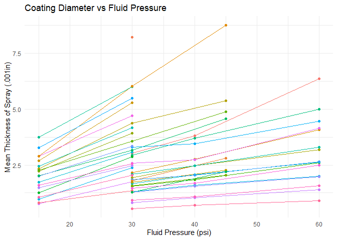

R Notebook
================

**C-13 Final Project, Jacob Prisament**

**Data Science  
  
  
Analysis of Spray Data from PVA ES-300 Valve**

This project is analyzing the spray data collected for the Blue Origin
Capstone team. About three weeks were spent collecting data to
characterize the valve and ensure that it would meet the performance
requirements of the project. It is a complicated system to understand as
there are 5 key variables that can be changed: movement speed, spray
height, needle setting, air pressure, and fluid pressure. These inputs
lead to a few outputs including spray diameter, and thickness. Edge
definition and overspray are important variables as well that weren’t
recorded due to time limitations.

The first half of the data was collected in groups of four coupons where
the the 1’s digit represents the spray feed rate, the 10’s digit
represents the elevation, and everything else is an identification
number. 4 coupons where sprayed at once with 111 112 113 114 being on
the same coupon and the 120s 130s and 140s being the other 3 coupons.
The spray settings picked the first set was somewhat arbitrary and for
the point of experimentation

The second half of the data only the 10’s series where collected and 1
coupon was sprayed at a time. A large range of needle fluid and air
settings were swept over. Only 1 variable was varied at a time to reduce
the overall testing time and make the operators life easier. About 100
coupons where sprayed during this second round of testing, but data was
only recorded for a smaller subsection.

After all of that data was collected, we realized a significant flaw in
our approach as we had forgotten to think about the effects of viscosity
over time. This fluid is a two part plastic that cures rapidly over its
life.

``` r
library(tidyverse)
```

    ## ── Attaching core tidyverse packages ──────────────────────── tidyverse 2.0.0 ──
    ## ✔ dplyr     1.1.4     ✔ readr     2.1.5
    ## ✔ forcats   1.0.0     ✔ stringr   1.5.1
    ## ✔ ggplot2   3.5.1     ✔ tibble    3.2.1
    ## ✔ lubridate 1.9.4     ✔ tidyr     1.3.1
    ## ✔ purrr     1.0.2     
    ## ── Conflicts ────────────────────────────────────────── tidyverse_conflicts() ──
    ## ✖ dplyr::filter() masks stats::filter()
    ## ✖ dplyr::lag()    masks stats::lag()
    ## ℹ Use the conflicted package (<http://conflicted.r-lib.org/>) to force all conflicts to become errors

``` r
df_spray <- read_csv("./data/spray_data.csv")
```

    ## New names:
    ## Rows: 156 Columns: 12
    ## ── Column specification
    ## ──────────────────────────────────────────────────────── Delimiter: "," chr
    ## (3): coat_dia, thick_mean, thick_sd dbl (7): test_num, spray_height,
    ## feed_mm_min, feed_mm_sec, fluid_psi, air_ps... lgl (2): ...11, ...12
    ## ℹ Use `spec()` to retrieve the full column specification for this data. ℹ
    ## Specify the column types or set `show_col_types = FALSE` to quiet this message.
    ## • `` -> `...11`
    ## • `` -> `...12`

``` r
print(df_spray)
```

    ## # A tibble: 156 × 12
    ##    test_num spray_height feed_mm_min feed_mm_sec fluid_psi air_psi needle
    ##       <dbl>        <dbl>       <dbl>       <dbl>     <dbl>   <dbl>  <dbl>
    ##  1      111         12.5        2000        33.3        30       6     12
    ##  2      112         12.5        4000        66.7        30       6     12
    ##  3      113         12.5        6000       100          30       6     12
    ##  4      114         12.5        9000       150          30       6     12
    ##  5      121         25          2000        33.3        30       6     12
    ##  6      122         25          4000        66.7        30       6     12
    ##  7      123         25          6000       100          30       6     12
    ##  8      124         25          9000       150          30       6     12
    ##  9      131         50          2000        33.3        30       6     12
    ## 10      132         50          4000        66.7        30       6     12
    ## # ℹ 146 more rows
    ## # ℹ 5 more variables: coat_dia <chr>, thick_mean <chr>, thick_sd <chr>,
    ## #   ...11 <lgl>, ...12 <lgl>

``` r
df_spray <- df_spray %>%
  mutate(feed_mm_sec = round(feed_mm_sec, 1))

df_viscosity <- read_csv("./data/Viscosity_data.csv")
```

    ## Rows: 20 Columns: 10
    ## ── Column specification ────────────────────────────────────────────────────────
    ## Delimiter: ","
    ## dbl (10): test_num, time_after_mix, spray_height, feed_mm_min, feed_mm_sec, ...
    ## 
    ## ℹ Use `spec()` to retrieve the full column specification for this data.
    ## ℹ Specify the column types or set `show_col_types = FALSE` to quiet this message.

``` r
print(df_viscosity)
```

    ## # A tibble: 20 × 10
    ##    test_num time_after_mix spray_height feed_mm_min feed_mm_sec fluid_psi
    ##       <dbl>          <dbl>        <dbl>       <dbl>       <dbl>     <dbl>
    ##  1     9511          0.366         12.5        2000        33.3        30
    ##  2     9512          0.366         12.5        4000        66.7        30
    ##  3     9513          0.366         12.5        6000       100          30
    ##  4     9514          0.366         12.5        9000       150          30
    ##  5     9611          1             12.5        2000        33.3        30
    ##  6     9612          1             12.5        4000        66.7        30
    ##  7     9613          1             12.5        6000       100          30
    ##  8     9614          1             12.5        9000       150          30
    ##  9     9711          2             12.5        2000        33.3        30
    ## 10     9712          2             12.5        4000        66.7        30
    ## 11     9713          2             12.5        6000       100          30
    ## 12     9714          2             12.5        9000       150          30
    ## 13     9811          3             12.5        2000        33.3        30
    ## 14     9812          3             12.5        4000        66.7        30
    ## 15     9813          3             12.5        6000       100          30
    ## 16     9814          3             12.5        9000       150          30
    ## 17     9911          3.5           12.5        2000        33.3        30
    ## 18     9912          3.5           12.5        4000        66.7        30
    ## 19     9913          3.5           12.5        6000       100          30
    ## 20     9914          3.5           12.5        9000       150          30
    ## # ℹ 4 more variables: air_psi <dbl>, needle <dbl>, coat_dia <dbl>,
    ## #   thick_mean <dbl>

``` r
df_viscosity <- df_viscosity %>%
  mutate(feed_mm_sec = round(feed_mm_sec, 1))
```

``` r
theme_common <- function() {
  theme_minimal() %+replace%
  theme(
    axis.text.x = element_text(size = 12),
    axis.text.y = element_text(size = 12),
    axis.title.x = element_text(margin = margin(4, 4, 4, 4), size = 16),
    axis.title.y = element_text(margin = margin(4, 4, 4, 4), size = 16, angle = 90),

    legend.title = element_text(size = 16),
    legend.text = element_text(size = 12),

    strip.text.x = element_text(size = 12),
    strip.text.y = element_text(size = 12),

    panel.grid.major = element_line(color = "grey90"),
    panel.grid.minor = element_line(color = "grey90"),

    aspect.ratio = 4 / 4,

    plot.margin = unit(c(t = +0, b = +0, r = +0, l = +0), "cm"),
    plot.title = element_text(size = 16,hjust=0),
    plot.title.position = "plot",
    plot.subtitle = element_text(size = 14),
    plot.caption = element_text(size = 12)
  )
}
```

``` r
df_viscosity %>%
  ggplot(aes(time_after_mix, coat_dia,color=thick_mean,shape=factor(feed_mm_sec))) +
    geom_point() +
    scale_color_gradient(low = "yellow", high = "red") +
    scale_shape_discrete(name = "Spray Speed") +
    labs(
      title = "Coating Diameter Over Time",
      x = "Time After Mix (Hrs)",
      y = "Coating Diameter",
      color = "Thickness"
    ) +
    theme_common()
```

<!-- -->

Unfortunately the effect of viscosity is significant and has a dramatic
effect on thickness, diameter, and mass-flow. Due to this any data
compared between variables that we changed with time such as the
pressures are hard to analyze without more intentional data collection
in the future.

``` r
df_spray <- df_spray %>%
  mutate(., thick_mean = round(as.numeric(thick_mean, na.rm = TRUE), 4)) %>%
  mutate(coat_dia = as.numeric(coat_dia, na.rm = TRUE))
```

    ## Warning: There was 1 warning in `mutate()`.
    ## ℹ In argument: `thick_mean = round(as.numeric(thick_mean, na.rm = TRUE), 4)`.
    ## Caused by warning:
    ## ! NAs introduced by coercion

    ## Warning: There was 1 warning in `mutate()`.
    ## ℹ In argument: `coat_dia = as.numeric(coat_dia, na.rm = TRUE)`.
    ## Caused by warning:
    ## ! NAs introduced by coercion

``` r
df <- df_spray %>%
  mutate(
    prefix_group = test_num %/% 100,      # Get "hundreds" group as you defined
    ones_digit = test_num %% 10,          # Get 1s digit
    group_id = paste0("G", prefix_group, "_O", ones_digit)
  )

# Plot
ggplot(df, aes(x = spray_height, y = coat_dia, group = group_id)) +
  geom_line(aes(color=group_id), na.rm = TRUE) +
  ylim(0, 2) +
  labs(
    title = "Coating Diameter vs Spray Height",
    x = "Spray Height (mm)",
    y = "Coating Diameter",
    color = "Thickness",
    linetype = "Group (100s & 1s)"
  ) +
  theme_common()+
  guides(color = "none")
```

<!-- -->

``` r
df %>%
  ggplot(aes(x = spray_height, y = thick_mean, group = group_id)) +
    geom_line(aes(color=group_id)) +
    labs(
      title = "Coating Thickness vs Spray Height",
      x = "Spray Height (mm)",
      y = "Coating Thickness",
      color = "Thickness",
      linetype = "Group (100s & 1s)"
    ) +
    theme_common()+
    guides(color = "none")
```

    ## Warning: Removed 1 row containing missing values or values outside the scale range
    ## (`geom_line()`).

<!-- -->

These graphs look at the data from the first set of testing where 4
coupons where sprayed at once. Since all the coupons where sprayed
within a minute it is fair to assume that viscosity didn’t play a large
effect and that the data is real. Unfortunately, there are no clear
relationships that can be taken from this data that connect spray height
and thickness or diameter. While many of the measurements do seem to
follow a nearly linear or logarithmic trend, multiple go in the
completely wrong direction, some are nearly flat, and others peak in the
middle. Overall, there is far to much variance to use this data for an
algorithmic relationship like we had originally hoped might be possible.
Instead, we have to use our results as a starting points for recommended
spray settings and let future operators work from there.

``` r
df <- df_spray %>%
  mutate(
    group_id = interaction(fluid_psi, air_psi, needle, spray_height, drop = TRUE)
  ) 

ggplot(df, aes(x = feed_mm_sec, y = coat_dia, color = group_id)) +
  geom_line() +
  geom_point() +
  labs(
    title = "Coating Diameter vs Feed Rate",
    x = "Feed Rate (mm/sec)",
    y = "Coating Diameter",
    color = "Grouped Conditions"
  ) +
  theme_common()
```

    ## Warning: Removed 29 rows containing missing values or values outside the scale range
    ## (`geom_line()`).

    ## Warning: Removed 30 rows containing missing values or values outside the scale range
    ## (`geom_point()`).

<!-- -->

``` r
ggplot(df, aes(x = feed_mm_sec, y = thick_mean, color = group_id)) +
  geom_line() +
  geom_point() +
  labs(
    title = "Coating Thickness vs Feed Rate",
    x = "Feed Rate (mm/sec)",
    y = "Coating Thickness (.001in)",
    color = "Grouped Conditions"
  ) +
  theme_common()
```

    ## Warning: Removed 1 row containing missing values or values outside the scale range
    ## (`geom_point()`).

<!-- -->

Surprisingly, feed rate has a much cleaner relationship with coating
thickness and diameter than height. This makes sense as the spray height
can effect the velocity that the coating hits the board with. On the
other hand feed rate only doesn’t directly effect how the spray
interacts with the board. Instead, federate controls massflow / unit
area. The faster the machine moves the less mass flow per unit area.
This would lead to purely linear behavior if not for the surface tension
of the fluid which prevents it from placing and an infinite height and
causes it to ooze out to the sides. Additionally, faster feed rates can
be correlated with worse edge definition and more overspray. Overspray
is not counted in the diameter measurement and therefore ends up as lost
volume for testing purposes. If there is less spray that is being
combined into the measured volume that would decrease the measured
thickness and diameter.

**Fluid System controlled Parameters:**

For the following graphs 4 variables are being held constant while the
5th is being varied. Viscosity could play a major part in some of these
results the order this data was collected in was not randomized. One
variable was generally varied over time per group of settings, but that
is not necessarily the same variable that is plotted on the x axis in
any one of these graphs for any given connected line.  
  
The results are very interesting for understanding the influence of
different variables on resultant sprays, but they generally speak for
themselves, so I won’t analyze them 1 by 1. The most interesting result
perhaps is fluid pressure on spray diameter which has no clear effect in
any direction. It should be noted for these results as well that spray
quality, overspray, and edge definition are not being considered and
have a large impact on the usability of any given spray setting.  

``` r
df <- df_spray %>%
  mutate(
    group_id = interaction(fluid_psi, air_psi,  feed_mm_sec, spray_height, drop = TRUE)
  ) %>%
  add_count(group_id) %>%
  filter(n > 1) %>%
  select(-n)

ggplot(df, aes(x =needle, y = coat_dia, color = group_id)) +
  geom_line() +
  geom_point() +
  labs(
    title = "Coating Diameter vs Needle Setting",
    x = "Needle Setting",
    y = "Coating Diameter (in)",
    color = "Grouped Conditions"
  ) +
  theme_minimal()+
  guides(color = "none")
```

    ## Warning: Removed 30 rows containing missing values or values outside the scale range
    ## (`geom_line()`).

    ## Warning: Removed 30 rows containing missing values or values outside the scale range
    ## (`geom_point()`).

<!-- -->

``` r
ggplot(df, aes(x =needle, y = thick_mean, color = group_id)) +
  geom_line() +
  geom_point() +
  labs(
    title = "Coating Diameter vs Needle Setting",
    x = "Needle Setting",
    y = "Mean Thickness of Spray (.001in)",
    color = "Grouped Conditions"
  ) +
  theme_common()+
  guides(color = "none")
```

    ## Warning: Removed 1 row containing missing values or values outside the scale range
    ## (`geom_point()`).

<!-- -->

``` r
df <- df_spray %>%
  mutate(
    group_id = interaction(needle, air_psi,  feed_mm_sec, spray_height, drop = TRUE)
  ) %>%
  add_count(group_id) %>%
  filter(n > 1) %>%
  select(-n)
  

ggplot(df, aes(x =fluid_psi, y = coat_dia, color = group_id)) +
  geom_line() +
  geom_point() +
  labs(
    title = "Coating Diameter vs Fluid Pressure",
    x = "Fluid Pressure (psi)",
    y = "Coating Diameter (in)",
    color = "Grouped Conditions"
  ) +
  theme_minimal()+
  guides(color = "none")
```

    ## Warning: Removed 2 rows containing missing values or values outside the scale range
    ## (`geom_line()`).

    ## Warning: Removed 2 rows containing missing values or values outside the scale range
    ## (`geom_point()`).

<!-- -->

``` r
ggplot(df, aes(x =fluid_psi, y = thick_mean, color = group_id)) +
  geom_line() +
  geom_point() +
  labs(
    title = "Coating Diameter vs Fluid Pressure",
    x = "Fluid Pressure (psi)",
    y = "Mean Thickness of Spray (.001in)",
    color = "Grouped Conditions"
  ) +
  theme_minimal()+
  guides(color = "none")
```

    ## Warning: Removed 1 row containing missing values or values outside the scale range
    ## (`geom_line()`).

    ## Warning: Removed 1 row containing missing values or values outside the scale range
    ## (`geom_point()`).

<!-- -->

``` r
df <- df_spray %>%
  mutate(
    group_id = interaction(needle, fluid_psi,  feed_mm_sec, spray_height, drop = TRUE)
  ) %>%
  add_count(group_id) %>%
  filter(n > 1) %>%
  select(-n)

ggplot(df, aes(x =air_psi, y = coat_dia, color = group_id)) +
  geom_line() +
  geom_point() +
  labs(
    title = "Coating Diameter vs Air Pressure",
    x = "Air Pressure (psi)",
    y = "Coating Diameter (in)",
    color = "Grouped Conditions"
  ) +
  theme_minimal()+
  guides(color = "none")
```

    ## Warning: Removed 26 rows containing missing values or values outside the scale range
    ## (`geom_line()`).

    ## Warning: Removed 26 rows containing missing values or values outside the scale range
    ## (`geom_point()`).

<!-- -->

``` r
ggplot(df, aes(x =air_psi, y = thick_mean, color = group_id)) +
  geom_line() +
  geom_point() +
  labs(
    title = "Coating Diameter vs Air Pressure",
    x = "Air Pressure (psi)",
    y = "Mean Thickness of Spray (.001in)",
    color = "Grouped Conditions"
  ) +
  theme_minimal()+
  guides(color = "none")
```

    ## Warning: Removed 1 row containing missing values or values outside the scale range
    ## (`geom_point()`).

<!-- -->
