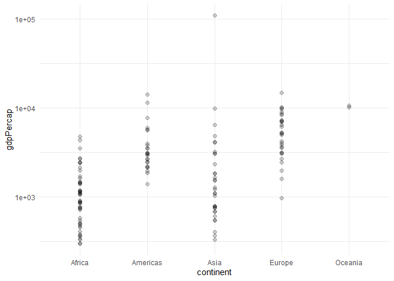
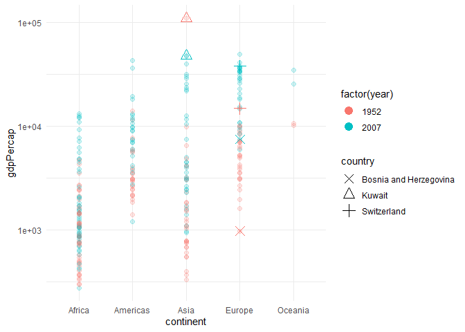
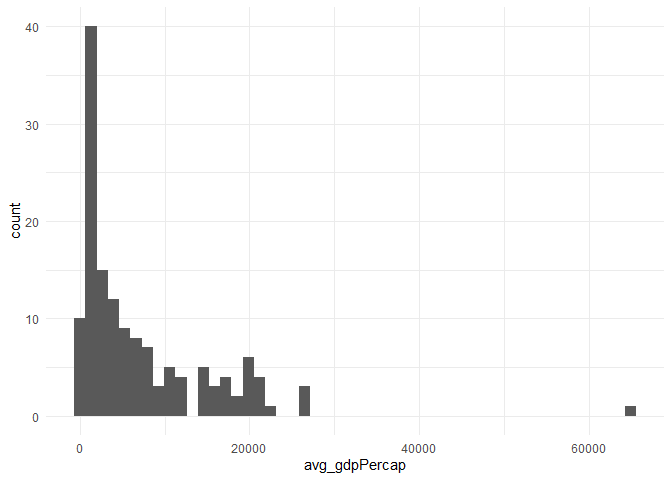
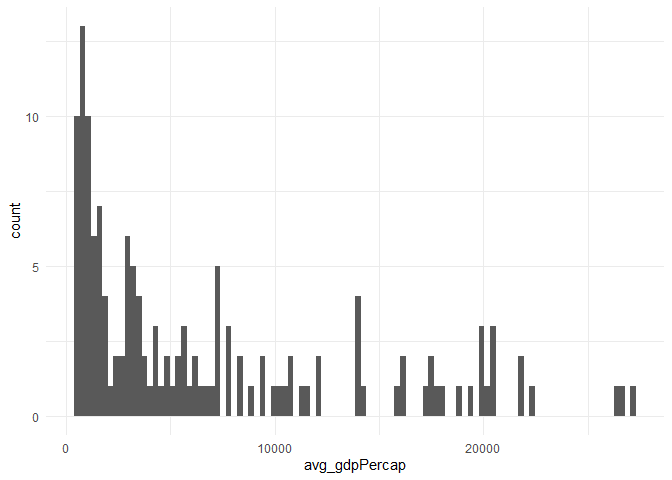
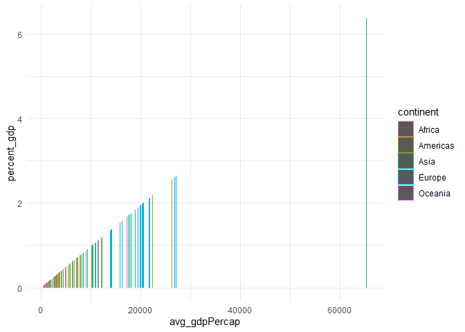
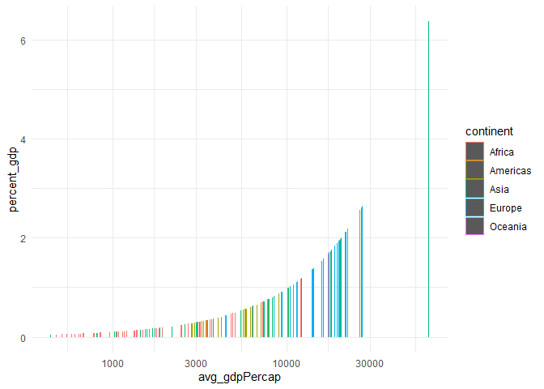
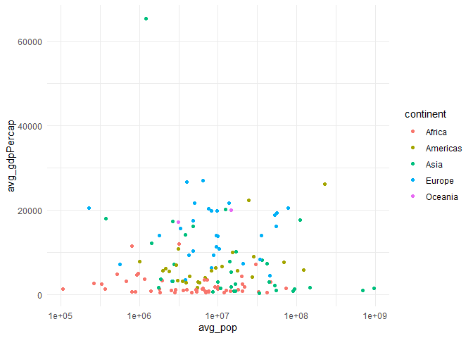
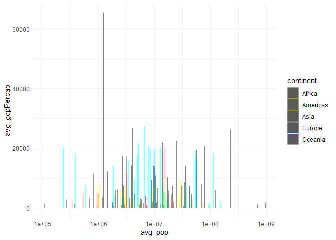
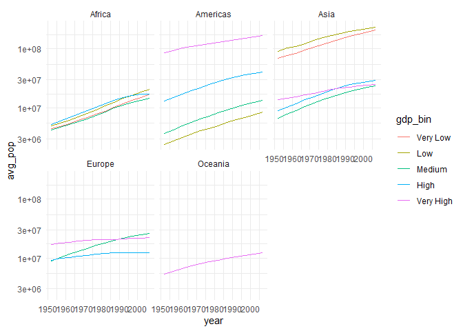
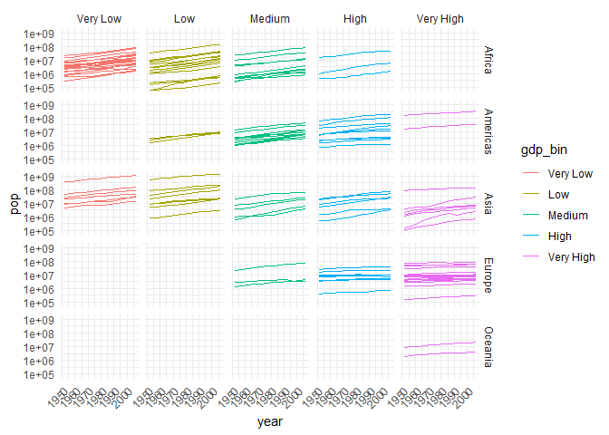

# Gapminder

(Your name here) 2020-

-   [Grading Rubric](#grading-rubric)
    -   [Individual](#individual)
    -   [Submission](#submission)
-   [Guided EDA](#guided-eda)
    -   [**q0** Perform your “first checks” on the dataset. What
        variables are in
        this](#q0-perform-your-first-checks-on-the-dataset-what-variables-are-in-this)
    -   [**q1** Determine the most and least recent years in the
        `gapminder`
        dataset.](#q1-determine-the-most-and-least-recent-years-in-the-gapminder-dataset)
    -   [**q2** Filter on years matching `year_min`, and make a plot of
        the GDP per capita against continent. Choose an appropriate
        `geom_` to visualize the data. What observations can you
        make?](#q2-filter-on-years-matching-year_min-and-make-a-plot-of-the-gdp-per-capita-against-continent-choose-an-appropriate-geom_-to-visualize-the-data-what-observations-can-you-make)
    -   [**q3** You should have found *at least* three outliers in q2
        (but possibly many more!). Identify those outliers (figure out
        which countries they
        are).](#q3-you-should-have-found-at-least-three-outliers-in-q2-but-possibly-many-more-identify-those-outliers-figure-out-which-countries-they-are)
    -   [**q4** Create a plot similar to yours from q2 studying both
        `year_min` and `year_max`. Find a way to highlight the outliers
        from q3 on your plot *in a way that lets you identify which
        country is which*. Compare the patterns between `year_min` and
        `year_max`.](#q4-create-a-plot-similar-to-yours-from-q2-studying-both-year_min-and-year_max-find-a-way-to-highlight-the-outliers-from-q3-on-your-plot-in-a-way-that-lets-you-identify-which-country-is-which-compare-the-patterns-between-year_min-and-year_max)
-   [Your Own EDA](#your-own-eda)
    -   [**q5** Create *at least* three new figures below. With each
        figure, try to pose new questions about the
        data.](#q5-create-at-least-three-new-figures-below-with-each-figure-try-to-pose-new-questions-about-the-data)

*Purpose*: Learning to do EDA well takes practice! In this challenge
you’ll further practice EDA by first completing a guided exploration,
then by conducting your own investigation. This challenge will also give
you a chance to use the wide variety of visual tools we’ve been
learning.

<!-- include-rubric -->

# Grading Rubric {#grading-rubric}

<!-- -------------------------------------------------- -->

Unlike exercises, **challenges will be graded**. The following rubrics
define how you will be graded, both on an individual and team basis.

## Individual {#individual}

<!-- ------------------------- -->

| Category | Needs Improvement | Satisfactory |
|----|----|----|
| Effort | Some task **q**’s left unattempted | All task **q**’s attempted |
| Observed | Did not document observations, or observations incorrect | Documented correct observations based on analysis |
| Supported | Some observations not clearly supported by analysis | All observations clearly supported by analysis (table, graph, etc.) |
| Assessed | Observations include claims not supported by the data, or reflect a level of certainty not warranted by the data | Observations are appropriately qualified by the quality & relevance of the data and (in)conclusiveness of the support |
| Specified | Uses the phrase “more data are necessary” without clarification | Any statement that “more data are necessary” specifies which *specific* data are needed to answer what *specific* question |
| Code Styled | Violations of the [style guide](https://style.tidyverse.org/) hinder readability | Code sufficiently close to the [style guide](https://style.tidyverse.org/) |

## Submission {#submission}

<!-- ------------------------- -->

Make sure to commit both the challenge report (`report.md` file) and
supporting files (`report_files/` folder) when you are done! Then submit
a link to Canvas. **Your Challenge submission is not complete without
all files uploaded to GitHub.**

``` r
library(tidyverse)
```

```         
## ── Attaching core tidyverse packages ──────────────────────── tidyverse 2.0.0 ──
## ✔ dplyr     1.1.4     ✔ readr     2.1.5
## ✔ forcats   1.0.0     ✔ stringr   1.5.1
## ✔ ggplot2   3.5.1     ✔ tibble    3.2.1
## ✔ lubridate 1.9.4     ✔ tidyr     1.3.1
## ✔ purrr     1.0.2     
## ── Conflicts ────────────────────────────────────────── tidyverse_conflicts() ──
## ✖ dplyr::filter() masks stats::filter()
## ✖ dplyr::lag()    masks stats::lag()
## ℹ Use the conflicted package (<http://conflicted.r-lib.org/>) to force all conflicts to become errors
```

``` r
library(gapminder)
```

*Background*: [Gapminder](https://www.gapminder.org/about-gapminder/) is
an independent organization that seeks to educate people about the state
of the world. They seek to counteract the worldview constructed by a
hype-driven media cycle, and promote a “fact-based worldview” by
focusing on data. The dataset we’ll study in this challenge is from
Gapminder.

# Guided EDA {#guided-eda}

<!-- -------------------------------------------------- -->

First, we’ll go through a round of *guided EDA*. Try to pay attention to
the high-level process we’re going through—after this guided round
you’ll be responsible for doing another cycle of EDA on your own!

### **q0** Perform your “first checks” on the dataset. What variables are in this

dataset?

``` r
## TASK: Do your "first checks" here!
##glimpse(gapminder)
head(gapminder)
```

```         
## # A tibble: 6 × 6
##   country     continent  year lifeExp      pop gdpPercap
##   <fct>       <fct>     <int>   <dbl>    <int>     <dbl>
## 1 Afghanistan Asia       1952    28.8  8425333      779.
## 2 Afghanistan Asia       1957    30.3  9240934      821.
## 3 Afghanistan Asia       1962    32.0 10267083      853.
## 4 Afghanistan Asia       1967    34.0 11537966      836.
## 5 Afghanistan Asia       1972    36.1 13079460      740.
## 6 Afghanistan Asia       1977    38.4 14880372      786.
```

``` r
summary(gapminder)
```

```         
##         country        continent        year         lifeExp     
##  Afghanistan:  12   Africa  :624   Min.   :1952   Min.   :23.60  
##  Albania    :  12   Americas:300   1st Qu.:1966   1st Qu.:48.20  
##  Algeria    :  12   Asia    :396   Median :1980   Median :60.71  
##  Angola     :  12   Europe  :360   Mean   :1980   Mean   :59.47  
##  Argentina  :  12   Oceania : 24   3rd Qu.:1993   3rd Qu.:70.85  
##  Australia  :  12                  Max.   :2007   Max.   :82.60  
##  (Other)    :1632                                                
##       pop              gdpPercap       
##  Min.   :6.001e+04   Min.   :   241.2  
##  1st Qu.:2.794e+06   1st Qu.:  1202.1  
##  Median :7.024e+06   Median :  3531.8  
##  Mean   :2.960e+07   Mean   :  7215.3  
##  3rd Qu.:1.959e+07   3rd Qu.:  9325.5  
##  Max.   :1.319e+09   Max.   :113523.1  
## 
```

**Observations**:

-   Country, Continent, Year, Life expectancy, Population

### **q1** Determine the most and least recent years in the `gapminder` dataset.

*Hint*: Use the `pull()` function to get a vector out of a tibble.
(Rather than the `$` notation of base R.)

``` r
## TASK: Find the largest and smallest values of `year` in `gapminder`
year_max <- 
    gapminder %>%
      pull(year) %>%
        max()
year_min <- gapminder %>%
      pull(year) %>%
        min()

print(year_max)
```

```         
## [1] 2007
```

``` r
print(year_min)
```

```         
## [1] 1952
```

Use the following test to check your work.

``` r
## NOTE: No need to change this
assertthat::assert_that(year_max %% 7 == 5)
```

```         
## [1] TRUE
```

``` r
assertthat::assert_that(year_max %% 3 == 0)
```

```         
## [1] TRUE
```

``` r
assertthat::assert_that(year_min %% 7 == 6)
```

```         
## [1] TRUE
```

``` r
assertthat::assert_that(year_min %% 3 == 2)
```

```         
## [1] TRUE
```

``` r
if (is_tibble(year_max)) {
  print("year_max is a tibble; try using `pull()` to get a vector")
  assertthat::assert_that(False)
}

print("Nice!")
```

```         
## [1] "Nice!"
```

### **q2** Filter on years matching `year_min`, and make a plot of the GDP per capita against continent. Choose an appropriate `geom_` to visualize the data. What observations can you make?

You may encounter difficulties in visualizing these data; if so document
your challenges and attempt to produce the most informative visual you
can.

``` r
## TASK: Create a visual of gdpPercap vs continent
year_min_data <-
  filter(gapminder,year==1952)
print(year_min_data)
```

```         
## # A tibble: 142 × 6
##    country     continent  year lifeExp      pop gdpPercap
##    <fct>       <fct>     <int>   <dbl>    <int>     <dbl>
##  1 Afghanistan Asia       1952    28.8  8425333      779.
##  2 Albania     Europe     1952    55.2  1282697     1601.
##  3 Algeria     Africa     1952    43.1  9279525     2449.
##  4 Angola      Africa     1952    30.0  4232095     3521.
##  5 Argentina   Americas   1952    62.5 17876956     5911.
##  6 Australia   Oceania    1952    69.1  8691212    10040.
##  7 Austria     Europe     1952    66.8  6927772     6137.
##  8 Bahrain     Asia       1952    50.9   120447     9867.
##  9 Bangladesh  Asia       1952    37.5 46886859      684.
## 10 Belgium     Europe     1952    68    8730405     8343.
## # ℹ 132 more rows
```

``` r
year_min_data %>%
  ggplot(aes(continent, gdpPercap)) +
    geom_point(size = 2, alpha = .2) +
    theme_minimal() + 
    scale_y_continuous(trans='log10')
```

<!-- -->

**Observations**:

-   Americas and europe have the highest max GDPs
-   Africa has the lowest average GDP
-   Asia has a very high outlier
-   Europe has a pretty consistent tight set of data but theres an
    strong outlier on both the high and low ends

**Difficulties & Approaches**:

-   The outlier in Asia makes it very different to distinguish the rest
    of the data since its such a higher value than anything else. Plus
    theres a significant number of countries with almost no GDP
    -   Used a log scale to make the data more readable
-   Overlapping points makes it difficult to estimate the density of the
    data
    -   set alpha to .2

### **q3** You should have found *at least* three outliers in q2 (but possibly many more!). Identify those outliers (figure out which countries they are).

``` r
## TASK: Identify the outliers from q2
##Outlier 1, asia
Asia_outlier <-
  gapminder %>%
    filter(year==1952) %>%
      filter(continent=="Asia") %>%
        arrange(desc(gdpPercap))
print(Asia_outlier)
```

```         
## # A tibble: 33 × 6
##    country          continent  year lifeExp      pop gdpPercap
##    <fct>            <fct>     <int>   <dbl>    <int>     <dbl>
##  1 Kuwait           Asia       1952    55.6   160000   108382.
##  2 Bahrain          Asia       1952    50.9   120447     9867.
##  3 Saudi Arabia     Asia       1952    39.9  4005677     6460.
##  4 Lebanon          Asia       1952    55.9  1439529     4835.
##  5 Iraq             Asia       1952    45.3  5441766     4130.
##  6 Israel           Asia       1952    65.4  1620914     4087.
##  7 Japan            Asia       1952    63.0 86459025     3217.
##  8 Hong Kong, China Asia       1952    61.0  2125900     3054.
##  9 Iran             Asia       1952    44.9 17272000     3035.
## 10 Singapore        Asia       1952    60.4  1127000     2315.
## # ℹ 23 more rows
```

``` r
##outlier 2/3 europe
Asia_outlier <-
  gapminder %>%
    filter(year==1952) %>%
      filter(continent=="Europe") %>%
        arrange((gdpPercap))
print(Asia_outlier)
```

```         
## # A tibble: 30 × 6
##    country                continent  year lifeExp      pop gdpPercap
##    <fct>                  <fct>     <int>   <dbl>    <int>     <dbl>
##  1 Bosnia and Herzegovina Europe     1952    53.8  2791000      974.
##  2 Albania                Europe     1952    55.2  1282697     1601.
##  3 Turkey                 Europe     1952    43.6 22235677     1969.
##  4 Bulgaria               Europe     1952    59.6  7274900     2444.
##  5 Montenegro             Europe     1952    59.2   413834     2648.
##  6 Portugal               Europe     1952    59.8  8526050     3068.
##  7 Croatia                Europe     1952    61.2  3882229     3119.
##  8 Romania                Europe     1952    61.0 16630000     3145.
##  9 Greece                 Europe     1952    65.9  7733250     3531.
## 10 Serbia                 Europe     1952    58.0  6860147     3581.
## # ℹ 20 more rows
```

``` r
Asia_outlier <-
  gapminder %>%
    filter(year==1952) %>%
      filter(continent=="Europe") %>%
        arrange(desc(gdpPercap))
print(Asia_outlier)
```

```         
## # A tibble: 30 × 6
##    country        continent  year lifeExp      pop gdpPercap
##    <fct>          <fct>     <int>   <dbl>    <int>     <dbl>
##  1 Switzerland    Europe     1952    69.6  4815000    14734.
##  2 Norway         Europe     1952    72.7  3327728    10095.
##  3 United Kingdom Europe     1952    69.2 50430000     9980.
##  4 Denmark        Europe     1952    70.8  4334000     9692.
##  5 Netherlands    Europe     1952    72.1 10381988     8942.
##  6 Sweden         Europe     1952    71.9  7124673     8528.
##  7 Belgium        Europe     1952    68    8730405     8343.
##  8 Iceland        Europe     1952    72.5   147962     7268.
##  9 Germany        Europe     1952    67.5 69145952     7144.
## 10 France         Europe     1952    67.4 42459667     7030.
## # ℹ 20 more rows
```

**Observations**:

-   Identify the outlier countries from q2
    -   High Outlier in Asia is Kuwait
    -   High in Europe is Switzerland
    -   Low in Europe is Bosnia

*Hint*: For the next task, it’s helpful to know a ggplot trick we’ll
learn in an upcoming exercise: You can use the `data` argument inside
any `geom_*` to modify the data that will be plotted *by that geom
only*. For instance, you can use this trick to filter a set of points to
label:

``` r
## NOTE: No need to edit, use ideas from this in q4 below
gapminder %>%
  filter(year == max(year)) %>%

  ggplot(aes(continent, lifeExp)) +
  geom_boxplot() +
  geom_point(
    data = . %>% filter(country %in% c("United Kingdom", "Japan", "Zambia")),
    mapping = aes(color = country),
    size = 2
  )
```

<!-- -->

### **q4** Create a plot similar to yours from q2 studying both `year_min` and `year_max`. Find a way to highlight the outliers from q3 on your plot *in a way that lets you identify which country is which*. Compare the patterns between `year_min` and `year_max`.

*Hint*: We’ve learned a lot of different ways to show multiple
variables; think about using different aesthetics or facets.

``` r
## TASK: Create a visual of gdpPercap vs continent
year_min_max_data <-
  filter(gapminder, year==max(year) | year==min(year))
print(year_min_max_data)
```

```         
## # A tibble: 284 × 6
##    country     continent  year lifeExp      pop gdpPercap
##    <fct>       <fct>     <int>   <dbl>    <int>     <dbl>
##  1 Afghanistan Asia       1952    28.8  8425333      779.
##  2 Afghanistan Asia       2007    43.8 31889923      975.
##  3 Albania     Europe     1952    55.2  1282697     1601.
##  4 Albania     Europe     2007    76.4  3600523     5937.
##  5 Algeria     Africa     1952    43.1  9279525     2449.
##  6 Algeria     Africa     2007    72.3 33333216     6223.
##  7 Angola      Africa     1952    30.0  4232095     3521.
##  8 Angola      Africa     2007    42.7 12420476     4797.
##  9 Argentina   Americas   1952    62.5 17876956     5911.
## 10 Argentina   Americas   2007    75.3 40301927    12779.
## # ℹ 274 more rows
```

``` r
year_min_max_data %>%
  ggplot(aes(continent, gdpPercap)) +
    geom_point(size = 2, alpha = .2, mapping=aes(color=factor(year))) +
    theme_minimal() + 
    scale_y_continuous(trans='log10')+
    geom_point(
      data = . %>% filter(country %in% c("Kuwait", "Switzerland", "Bosnia and Herzegovina")),
      mapping = aes(color = factor(year),shape=country),
      size = 4
  )+
    scale_shape_manual(values = c("Kuwait" = 2, "Switzerland" = 3, "Bosnia and Herzegovina" = 4 ))
```

<!-- -->

**Observations**:

-   Kuwait has remained as the highest GDP in asia as well as one of the
    highest in the whole world but is no longer a nearly as significant
    of an outlier
-   Switzerland has lost its lead on europe and and while still near the
    top is no longer the highest or an outlier in the same way
-   Bosnia remains near the bottom of europe but has risen in GDP with
    the rest of the rejoin as is no longer the lowest GDP in the region.

# Your Own EDA {#your-own-eda}

<!-- -------------------------------------------------- -->

Now it’s your turn! We just went through guided EDA considering the GDP
per capita at two time points. You can continue looking at outliers,
consider different years, repeat the exercise with `lifeExp`, consider
the relationship between variables, or something else entirely.

### **q5** Create *at least* three new figures below. With each figure, try to pose new questions about the data.

``` r
## TASK: Your first graph
data_summary <- gapminder %>%
  group_by(country,continent) %>%
  summarize(
    avg_lifeExp = mean(lifeExp, na.rm = TRUE),
    avg_pop = mean(pop, na.rm = TRUE),
    avg_gdpPercap = mean(gdpPercap, na.rm = TRUE),
    .groups = "drop"  # optional: ungroup the result
  )
data_summary <-
  data_summary %>%
    mutate(percent_gdp=100*(avg_gdpPercap/(sum(avg_gdpPercap))))
print(data_summary)
```

```         
## # A tibble: 142 × 6
##    country     continent avg_lifeExp   avg_pop avg_gdpPercap percent_gdp
##    <fct>       <fct>           <dbl>     <dbl>         <dbl>       <dbl>
##  1 Afghanistan Asia             37.5 15823715.          803.      0.0783
##  2 Albania     Europe           68.4  2580249.         3255.      0.318 
##  3 Algeria     Africa           59.0 19875406.         4426.      0.432 
##  4 Angola      Africa           37.9  7309390.         3607.      0.352 
##  5 Argentina   Americas         69.1 28602240.         8956.      0.874 
##  6 Australia   Oceania          74.7 14649312.        19981.      1.95  
##  7 Austria     Europe           73.1  7583298.        20412.      1.99  
##  8 Bahrain     Asia             65.6   373913.        18078.      1.76  
##  9 Bangladesh  Asia             49.8 90755395.          818.      0.0798
## 10 Belgium     Europe           73.6  9725119.        19901.      1.94  
## # ℹ 132 more rows
```

``` r
data_summary %>%
  ggplot(aes(avg_gdpPercap)) +
      geom_histogram(bins=50) +
      theme_minimal()
```

<!-- -->

``` r
      #scale_y_continuous(trans='log10')
data_summary %>%
  filter(avg_gdpPercap<30000) %>%
    ggplot(aes(avg_gdpPercap)) +
      geom_histogram(bins=100) +
      theme_minimal()
```

<!-- -->

``` r
data_summary %>%
  ggplot(aes(avg_gdpPercap,percent_gdp,color=continent)) +
      geom_col() +
      theme_minimal()
```

<!-- -->

``` r
      #scale_x_continuous(trans='log10')
data_summary %>%
  ggplot(aes(avg_gdpPercap,percent_gdp,color=continent)) +
      geom_col() +
      theme_minimal() +
      scale_x_continuous(trans='log10')
```

<!-- -->

-   Question:
    -   Distribution of average GDPs over the timespan
-   This graph shows the inequity in our economic systems. There are far
    more countries with very low GDPs than there are countries in the
    middle of the gdp range. The non log graph shows even more strongly
    how some countries control far more money than many poorer countries
    put together.
-   This inspired my next set off graphs that look at percentage of
    overall GDP global based on average gdp
    -   the largest gdp country in Asia controls the largest percent of
        global gdp at over 6 percent, meanwhile many of the countries in
        Asia have an almost immeasurable percentage of global gdp
    -   in Europe many countries have between 2-3 percent of global gdp
    -   logically, this graph shows a directly linear relationship

``` r
## TASK: Your second graph
data_summary %>%
  ggplot(aes(avg_pop,avg_gdpPercap, color=continent)) +
      geom_point() +
      theme_minimal() + 
      scale_x_continuous(trans='log10')
```

<!-- -->

``` r
data_summary %>%
  ggplot(aes(avg_pop,avg_gdpPercap, color=continent)) +
      geom_col() +
      theme_minimal() + 
      scale_x_continuous(trans='log10')
```

<!-- -->

-   (Your notes and observations here)
-   Question: How does population effect GDP?
    -   Highest populations are in Asia
    -   Both very high population and very low population seems to lead
        to a lower average GDP
    -   In general there doesn’t seem to be a strong correlation between
        avg population and avg gdp

``` r
## TASK: Your third graph
# 1. Calculate the average GDP per country (across all years). Averaging first so that a country can't change categories over the course of time
country_gdp_avg <- 
  gapminder %>%
    group_by(country) %>%
    summarise(
      avg_gdpPercap = mean(gdpPercap, na.rm = TRUE),
      .groups = "drop"
    )

# 2. Bin countries based on their average GDP
country_gdp_avg <- 
  country_gdp_avg %>%
    mutate(
      gdp_bin = cut(
        avg_gdpPercap,
        breaks = quantile(avg_gdpPercap, probs = seq(0, 1, by = 0.2), na.rm = TRUE),
        include.lowest = TRUE,
        labels = c("Very Low", "Low", "Medium", "High", "Very High")
      )
    )

# 3. Merge the GDP bin info back into the full dataset
df_with_bins <- 
  gapminder %>%
    left_join(country_gdp_avg %>% select(country, gdp_bin), by = "country")

# 4. Group by year and gdp_bin, then average other values
df_summary <- 
  df_with_bins %>%
    group_by(year, gdp_bin, continent) %>%
    summarise(
      avg_lifeExp = mean(lifeExp, na.rm = TRUE),
      avg_pop = mean(pop, na.rm = TRUE),
      avg_gdpPercap = mean(gdpPercap, na.rm = TRUE),
      .groups = "drop"
    )
print(df_with_bins)
```

```         
## # A tibble: 1,704 × 7
##    country     continent  year lifeExp      pop gdpPercap gdp_bin 
##    <fct>       <fct>     <int>   <dbl>    <int>     <dbl> <fct>   
##  1 Afghanistan Asia       1952    28.8  8425333      779. Very Low
##  2 Afghanistan Asia       1957    30.3  9240934      821. Very Low
##  3 Afghanistan Asia       1962    32.0 10267083      853. Very Low
##  4 Afghanistan Asia       1967    34.0 11537966      836. Very Low
##  5 Afghanistan Asia       1972    36.1 13079460      740. Very Low
##  6 Afghanistan Asia       1977    38.4 14880372      786. Very Low
##  7 Afghanistan Asia       1982    39.9 12881816      978. Very Low
##  8 Afghanistan Asia       1987    40.8 13867957      852. Very Low
##  9 Afghanistan Asia       1992    41.7 16317921      649. Very Low
## 10 Afghanistan Asia       1997    41.8 22227415      635. Very Low
## # ℹ 1,694 more rows
```

``` r
print(df_summary)
```

```         
## # A tibble: 204 × 6
##     year gdp_bin  continent avg_lifeExp   avg_pop avg_gdpPercap
##    <int> <fct>    <fct>           <dbl>     <dbl>         <dbl>
##  1  1952 Very Low Africa           36.7  4379310.          588.
##  2  1952 Very Low Asia             36.6 69646914.          552.
##  3  1952 Low      Africa           39.2  4903536.         1218.
##  4  1952 Low      Americas         41.8  2403429          1811.
##  5  1952 Low      Asia             44.4 90589138.          856.
##  6  1952 Medium   Africa           43.6  4223019.         2009.
##  7  1952 Medium   Americas         48.8  3658585.         2775.
##  8  1952 Medium   Asia             46.3  6667566.         1459.
##  9  1952 Medium   Europe           50.9  8769791.         1515.
## 10  1952 High     Africa           41.6  5235122          3802.
## # ℹ 194 more rows
```

``` r
df_summary  %>%
  ggplot(aes(year,avg_pop, color=gdp_bin)) +
      geom_line() +
      theme_minimal() +
      facet_wrap(~continent) +
      scale_y_continuous(trans='log10')
```

<!-- -->

``` r
df_with_bins %>%
  ggplot(aes(year,pop, color=gdp_bin,group=country)) +
    geom_line() +
    theme_minimal() +
    facet_grid(continent~gdp_bin) +
    scale_y_continuous(trans='log10') +
    theme(axis.text.x = element_text(angle = 45, hjust = 1))
```

<!-- -->

-   How does average GDP range of a country effect population growth of
    that country over time, and is it effected by region?
    -   **Cool thing**
        -   At first I binned the entire dataset, however this messed up
            my graphs as some countries moved between bins overtime so
            instead I averaged the countries gdp first before sorting it
            into a bin
    -   I used a log scale to make population changes more apparent
    -   Africa saw the most consistent steady population growth across
        gdp bins, with gdp having little effect on population growth.
    -   Europes population growth is relatively flat for high and very
        high gdps, but there is significant growth for medium gpd
        countries
    -   High gdp in asia has a higher growth than very high gdp
-   I was worried that individual countries was throwing of the results
    I was seeing in the bins so I also made a facet_grid that plots
    lines for all the countries at once over time, still visualized by
    gdp bin, but not averaged
    -   This gave a much more detailed view into the data
        -   For example two of the 3 countries in the medium gdp bin for
            europe had significant growth, but the third did not
        -   Some high income countries in Asia are have very large
            population changes while most are relatively flat over time
        -   Medium income countries in the Americas follow a very
            consistent curve over time across countries with limited
            variance.
