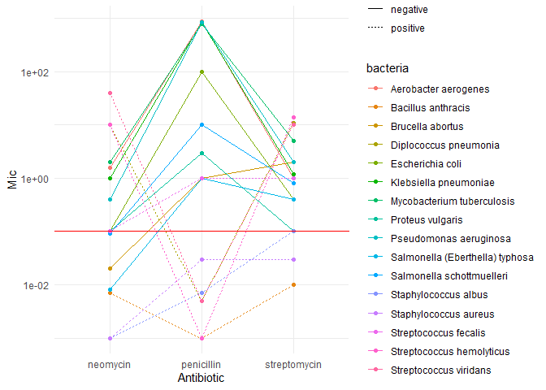
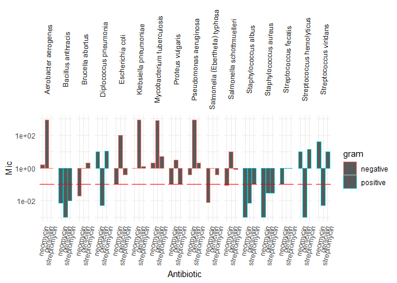
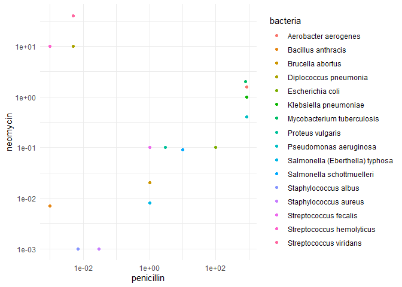
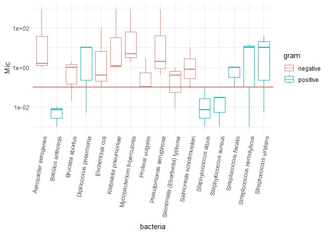
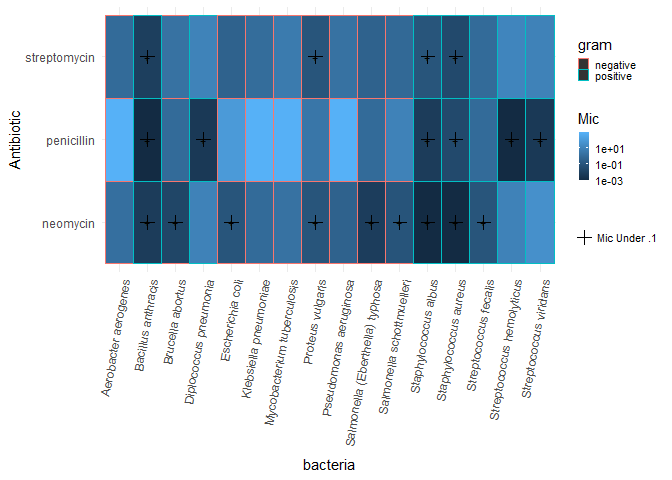

Antibiotics
================
(Your name here)
2020-

*Purpose*: Creating effective data visualizations is an *iterative*
process; very rarely will the first graph you make be the most
effective. The most effective thing you can do to be successful in this
iterative process is to *try multiple graphs* of the same data.

Furthermore, judging the effectiveness of a visual is completely
dependent on *the question you are trying to answer*. A visual that is
totally ineffective for one question may be perfect for answering a
different question.

In this challenge, you will practice *iterating* on data visualization,
and will anchor the *assessment* of your visuals using two different
questions.

*Note*: Please complete your initial visual design **alone**. Work on
both of your graphs alone, and save a version to your repo *before*
coming together with your team. This way you can all bring a diversity
of ideas to the table!

<!-- include-rubric -->

# Grading Rubric

<!-- -------------------------------------------------- -->

Unlike exercises, **challenges will be graded**. The following rubrics
define how you will be graded, both on an individual and team basis.

## Individual

<!-- ------------------------- -->

| Category | Needs Improvement | Satisfactory |
|----|----|----|
| Effort | Some task **q**’s left unattempted | All task **q**’s attempted |
| Observed | Did not document observations, or observations incorrect | Documented correct observations based on analysis |
| Supported | Some observations not clearly supported by analysis | All observations clearly supported by analysis (table, graph, etc.) |
| Assessed | Observations include claims not supported by the data, or reflect a level of certainty not warranted by the data | Observations are appropriately qualified by the quality & relevance of the data and (in)conclusiveness of the support |
| Specified | Uses the phrase “more data are necessary” without clarification | Any statement that “more data are necessary” specifies which *specific* data are needed to answer what *specific* question |
| Code Styled | Violations of the [style guide](https://style.tidyverse.org/) hinder readability | Code sufficiently close to the [style guide](https://style.tidyverse.org/) |

## Submission

<!-- ------------------------- -->

Make sure to commit both the challenge report (`report.md` file) and
supporting files (`report_files/` folder) when you are done! Then submit
a link to Canvas. **Your Challenge submission is not complete without
all files uploaded to GitHub.**

``` r
library(tidyverse)
```

    ## ── Attaching core tidyverse packages ──────────────────────── tidyverse 2.0.0 ──
    ## ✔ dplyr     1.1.4     ✔ readr     2.1.5
    ## ✔ forcats   1.0.0     ✔ stringr   1.5.1
    ## ✔ ggplot2   3.5.1     ✔ tibble    3.2.1
    ## ✔ lubridate 1.9.4     ✔ tidyr     1.3.1
    ## ✔ purrr     1.0.2     
    ## ── Conflicts ────────────────────────────────────────── tidyverse_conflicts() ──
    ## ✖ dplyr::filter() masks stats::filter()
    ## ✖ dplyr::lag()    masks stats::lag()
    ## ℹ Use the conflicted package (<http://conflicted.r-lib.org/>) to force all conflicts to become errors

``` r
library(ggrepel)
```

*Background*: The data\[1\] we study in this challenge report the
[*minimum inhibitory
concentration*](https://en.wikipedia.org/wiki/Minimum_inhibitory_concentration)
(MIC) of three drugs for different bacteria. The smaller the MIC for a
given drug and bacteria pair, the more practical the drug is for
treating that particular bacteria. An MIC value of *at most* 0.1 is
considered necessary for treating human patients.

These data report MIC values for three antibiotics—penicillin,
streptomycin, and neomycin—on 16 bacteria. Bacteria are categorized into
a genus based on a number of features, including their resistance to
antibiotics.

``` r
## NOTE: If you extracted all challenges to the same location,
## you shouldn't have to change this filename
filename <- "./data/antibiotics.csv"

## Load the data
df_antibiotics <- read_csv(filename)
```

    ## Rows: 16 Columns: 5
    ## ── Column specification ────────────────────────────────────────────────────────
    ## Delimiter: ","
    ## chr (2): bacteria, gram
    ## dbl (3): penicillin, streptomycin, neomycin
    ## 
    ## ℹ Use `spec()` to retrieve the full column specification for this data.
    ## ℹ Specify the column types or set `show_col_types = FALSE` to quiet this message.

``` r
df_antibiotics %>% knitr::kable()
```

| bacteria                        | penicillin | streptomycin | neomycin | gram     |
|:--------------------------------|-----------:|-------------:|---------:|:---------|
| Aerobacter aerogenes            |    870.000 |         1.00 |    1.600 | negative |
| Brucella abortus                |      1.000 |         2.00 |    0.020 | negative |
| Bacillus anthracis              |      0.001 |         0.01 |    0.007 | positive |
| Diplococcus pneumonia           |      0.005 |        11.00 |   10.000 | positive |
| Escherichia coli                |    100.000 |         0.40 |    0.100 | negative |
| Klebsiella pneumoniae           |    850.000 |         1.20 |    1.000 | negative |
| Mycobacterium tuberculosis      |    800.000 |         5.00 |    2.000 | negative |
| Proteus vulgaris                |      3.000 |         0.10 |    0.100 | negative |
| Pseudomonas aeruginosa          |    850.000 |         2.00 |    0.400 | negative |
| Salmonella (Eberthella) typhosa |      1.000 |         0.40 |    0.008 | negative |
| Salmonella schottmuelleri       |     10.000 |         0.80 |    0.090 | negative |
| Staphylococcus albus            |      0.007 |         0.10 |    0.001 | positive |
| Staphylococcus aureus           |      0.030 |         0.03 |    0.001 | positive |
| Streptococcus fecalis           |      1.000 |         1.00 |    0.100 | positive |
| Streptococcus hemolyticus       |      0.001 |        14.00 |   10.000 | positive |
| Streptococcus viridans          |      0.005 |        10.00 |   40.000 | positive |

``` r
glimpse(df_antibiotics)
```

    ## Rows: 16
    ## Columns: 5
    ## $ bacteria     <chr> "Aerobacter aerogenes", "Brucella abortus", "Bacillus ant…
    ## $ penicillin   <dbl> 870.000, 1.000, 0.001, 0.005, 100.000, 850.000, 800.000, …
    ## $ streptomycin <dbl> 1.00, 2.00, 0.01, 11.00, 0.40, 1.20, 5.00, 0.10, 2.00, 0.…
    ## $ neomycin     <dbl> 1.600, 0.020, 0.007, 10.000, 0.100, 1.000, 2.000, 0.100, …
    ## $ gram         <chr> "negative", "negative", "positive", "positive", "negative…

# Visualization

<!-- -------------------------------------------------- -->

### **q1** Prototype 5 visuals

To start, construct **5 qualitatively different visualizations of the
data** `df_antibiotics`. These **cannot** be simple variations on the
same graph; for instance, if two of your visuals could be made identical
by calling `coord_flip()`, then these are *not* qualitatively different.

For all five of the visuals, you must show information on *all 16
bacteria*. For the first two visuals, you must *show all variables*.

*Hint 1*: Try working quickly on this part; come up with a bunch of
ideas, and don’t fixate on any one idea for too long. You will have a
chance to refine later in this challenge.

*Hint 2*: The data `df_antibiotics` are in a *wide* format; it may be
helpful to `pivot_longer()` the data to make certain visuals easier to
construct.

#### Visual 1 (All variables)

In this visual you must show *all three* effectiveness values for *all
16 bacteria*. This means **it must be possible to identify each of the
16 bacteria by name.** You must also show whether or not each bacterium
is Gram positive or negative.

``` r
# WRITE YOUR CODE HERE
#Lets start off easy with a lineplot
data_long <- df_antibiotics %>%
  pivot_longer(cols = c("penicillin","streptomycin","neomycin"), 
               names_to = "Antibiotic", 
               values_to = "Mic")
print(data_long)
```

    ## # A tibble: 48 × 4
    ##    bacteria              gram     Antibiotic       Mic
    ##    <chr>                 <chr>    <chr>          <dbl>
    ##  1 Aerobacter aerogenes  negative penicillin   870    
    ##  2 Aerobacter aerogenes  negative streptomycin   1    
    ##  3 Aerobacter aerogenes  negative neomycin       1.6  
    ##  4 Brucella abortus      negative penicillin     1    
    ##  5 Brucella abortus      negative streptomycin   2    
    ##  6 Brucella abortus      negative neomycin       0.02 
    ##  7 Bacillus anthracis    positive penicillin     0.001
    ##  8 Bacillus anthracis    positive streptomycin   0.01 
    ##  9 Bacillus anthracis    positive neomycin       0.007
    ## 10 Diplococcus pneumonia positive penicillin     0.005
    ## # ℹ 38 more rows

``` r
data_long %>%
   ggplot(aes(Antibiotic,Mic,group=bacteria, color=bacteria)) +
      geom_line(aes(linetype = gram)) +
      geom_point()  +
      theme_minimal()+
      scale_y_continuous(trans='log10')+
      geom_abline(aes(intercept = log10(1E-01), slope=0), col="red", lwd=.5)
```

<!-- -->

#### Visual 2 (All variables)

In this visual you must show *all three* effectiveness values for *all
16 bacteria*. This means **it must be possible to identify each of the
16 bacteria by name.** You must also show whether or not each bacterium
is Gram positive or negative.

Note that your visual must be *qualitatively different* from *all* of
your other visuals.

``` r
# WRITE YOUR CODE HERE
data_long %>%
   ggplot(aes(Antibiotic,Mic, color=gram)) +
      geom_col() +
      facet_grid(~bacteria) +
      theme_minimal()+
      geom_abline(aes(intercept = log10(1E-01), slope=0), col="red", lwd=.5)+
      scale_y_continuous(trans='log10')+
      theme(axis.text.x = element_text(angle = 80, hjust = 1))+
      theme(strip.text = element_text(angle = 88))
```

<!-- -->

#### Visual 3 (Some variables)

In this visual you may show a *subset* of the variables (`penicillin`,
`streptomycin`, `neomycin`, `gram`), but you must still show *all 16
bacteria*.

Note that your visual must be *qualitatively different* from *all* of
your other visuals.

``` r
# WRITE YOUR CODE HERE
#is there a correlation between two effectivenesses 
df_antibiotics %>%
   ggplot(aes(penicillin,neomycin, color=bacteria)) +
      geom_point()  +
      theme_minimal()+
      scale_y_continuous(trans='log10')+
      scale_x_continuous(trans='log10')
```

<!-- -->

#### Visual 4 (Some variables)

In this visual you may show a *subset* of the variables (`penicillin`,
`streptomycin`, `neomycin`, `gram`), but you must still show *all 16
bacteria*.

Note that your visual must be *qualitatively different* from *all* of
your other visuals.

``` r
# WRITE YOUR CODE  Box Plot
data_long %>%
   ggplot(aes(bacteria, Mic, color=gram)) +
      geom_boxplot()  +
      theme_minimal()+
      scale_y_continuous(trans='log10') +
      theme(axis.text.x = element_text(angle = 80, hjust = 1))+
      geom_abline(aes(intercept = log10(1E-01), slope=0), col="red", lwd=.5)
```

<!-- -->

#### Visual 5 (Some variables)

In this visual you may show a *subset* of the variables (`penicillin`,
`streptomycin`, `neomycin`, `gram`), but you must still show *all 16
bacteria*.

Note that your visual must be *qualitatively different* from *all* of
your other visuals.

``` r
# WRITE YOUR CODE HERE Heat Map
data_long %>%
   ggplot(aes(bacteria, Antibiotic, fill=Mic, color=gram)) +
      geom_tile()  +
      theme_minimal() +
      geom_text(aes(label = ifelse(Mic<=.1, "+", "")), color = "black", size = 3) +
      geom_point(data = . %>% filter(Mic<=.1),
               aes(bacteria, Antibiotic, shape = "Mic Under .1"),
               color = "black", size = 3, inherit.aes = FALSE) +
      scale_shape_manual(name = "", values = c("Mic Under .1" = 3)) +
      theme(
      axis.text.x = element_text(angle = 80, hjust = 1),
      legend.key.size = unit(0.5, "lines"),    # smaller legend boxes
      legend.text = element_text(size = 8)     # smaller text
      )+
      scale_fill_continuous(trans='log10') +
      theme(axis.text.x = element_text(angle = 80, hjust = 1))
```

<!-- -->

### **q2** Assess your visuals

There are **two questions** below; use your five visuals to help answer
both Guiding Questions. Note that you must also identify which of your
five visuals were most helpful in answering the questions.

*Hint 1*: It’s possible that *none* of your visuals is effective in
answering the questions below. You may need to revise one or more of
your visuals to answer the questions below!

*Hint 2*: It’s **highly unlikely** that the same visual is the most
effective at helping answer both guiding questions. **Use this as an
opportunity to think about why this is.**

#### Guiding Question 1

> How do the three antibiotics vary in their effectiveness against
> bacteria of different genera and Gram stain?

*Observations* -  
What is your response to the question above? - Penicillin seems to be
either the most effective or the least effective at fighting bacteria.
Neomycin is the most effective general antibiotic against a wide range
of bacteria. Neomycin is also the best antibiotic against gram negative
bacteria with penecilin not being effective against any and streptomycin
only being effective on 1 gram negative bacteria. Streptomycin isn’t
effective against any unique bacteria that one of the others isn’t
effective against.

  
Which of your visuals above (1 through 5) is **most effective** at
helping to answer this question? - Graphs 1 and 5 are most effective.

Why? - This question benefits from a graph that shows as much
information at once which graphs 1 and 5 excel at. Additionally, they
both clearly identify which values fall under the threshold of .1 which
is very advantageous for identifying effectiveness! Personally I find
the colors in graph 5 more helpful than the dashed lines in graph 1 for
looking at gram positive versus negative. However in terms of relative
performance between antibiotics on the same bacteria graph 1 is much
more visually clear than the heatmap. Graph 4 doesn’t identify specific
antibiotics, graph 3 is more specific than this question, and graph 2 is
harder to pull summary information from due to the size and spread of
the data on the box plots.

#### Guiding Question 2

In 1974 *Diplococcus pneumoniae* was renamed *Streptococcus pneumoniae*,
and in 1984 *Streptococcus fecalis* was renamed *Enterococcus fecalis*
\[2\].

> Why was *Diplococcus pneumoniae* was renamed *Streptococcus
> pneumoniae*?

*Observations* - What is your response to the question above?
Diplococcus Pneumoniae was renaimed to Streptococcus Pneumoniae because
like the other Streptococcus bacteria penicillin is very effective on
Diplococcus Pneumoniae while Neomycin is very ineffective on the
bacteria. This can be seen in the top left corner of graph 3. On the
other hand, *Streptococcus fecalis* sees poor response to penicillin.

\- Which of your visuals above (1 through 5) is **most effective** at
helping to answer this question? - Graph 2 is the most effective

\- Why? - Graph 2 clearly groups bacteria into groups based on the
comparative effectiveness of Penicillin and Neomycin, this is perfect
for noticing the trends between the Streptococcus bacteria.

# References

<!-- -------------------------------------------------- -->

\[1\] Neomycin in skin infections: A new topical antibiotic with wide
antibacterial range and rarely sensitizing. Scope. 1951;3(5):4-7.

\[2\] Wainer and Lysen, “That’s Funny…” *American Scientist* (2009)
[link](https://www.americanscientist.org/article/thats-funny)
