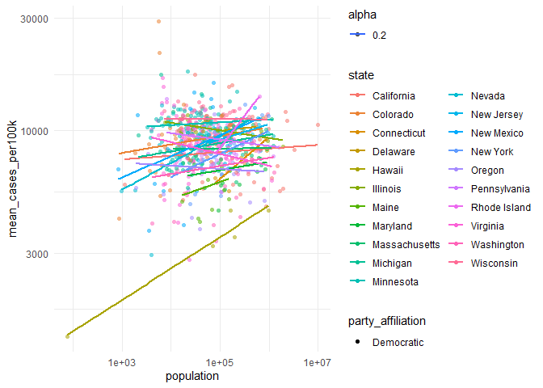

COVID-19
================
(Your name here)
2020-

- [Grading Rubric](#grading-rubric)
  - [Individual](#individual)
  - [Submission](#submission)
- [The Big Picture](#the-big-picture)
- [Get the Data](#get-the-data)
  - [Navigating the Census Bureau](#navigating-the-census-bureau)
    - [**q1** Load Table `B01003` into the following tibble. Make sure
      the column names are
      `id, Geographic Area Name, Estimate!!Total, Margin of Error!!Total`.](#q1-load-table-b01003-into-the-following-tibble-make-sure-the-column-names-are-id-geographic-area-name-estimatetotal-margin-of-errortotal)
  - [Automated Download of NYT Data](#automated-download-of-nyt-data)
    - [**q2** Visit the NYT GitHub repo and find the URL for the **raw**
      US County-level data. Assign that URL as a string to the variable
      below.](#q2-visit-the-nyt-github-repo-and-find-the-url-for-the-raw-us-county-level-data-assign-that-url-as-a-string-to-the-variable-below)
- [Join the Data](#join-the-data)
  - [**q3** Process the `id` column of `df_pop` to create a `fips`
    column.](#q3-process-the-id-column-of-df_pop-to-create-a-fips-column)
  - [**q4** Join `df_covid` with `df_q3` by the `fips` column. Use the
    proper type of join to preserve *only* the rows in
    `df_covid`.](#q4-join-df_covid-with-df_q3-by-the-fips-column-use-the-proper-type-of-join-to-preserve-only-the-rows-in-df_covid)
- [Analyze](#analyze)
  - [Normalize](#normalize)
    - [**q5** Use the `population` estimates in `df_data` to normalize
      `cases` and `deaths` to produce per 100,000 counts \[3\]. Store
      these values in the columns `cases_per100k` and
      `deaths_per100k`.](#q5-use-the-population-estimates-in-df_data-to-normalize-cases-and-deaths-to-produce-per-100000-counts-3-store-these-values-in-the-columns-cases_per100k-and-deaths_per100k)
  - [Guided EDA](#guided-eda)
    - [**q6** Compute some summaries](#q6-compute-some-summaries)
    - [**q7** Find and compare the top
      10](#q7-find-and-compare-the-top-10)
  - [Self-directed EDA](#self-directed-eda)
    - [**q8** Drive your own ship: You’ve just put together a very rich
      dataset; you now get to explore! Pick your own direction and
      generate at least one punchline figure to document an interesting
      finding. I give a couple tips & ideas
      below:](#q8-drive-your-own-ship-youve-just-put-together-a-very-rich-dataset-you-now-get-to-explore-pick-your-own-direction-and-generate-at-least-one-punchline-figure-to-document-an-interesting-finding-i-give-a-couple-tips--ideas-below)
    - [Ideas](#ideas)
    - [Aside: Some visualization
      tricks](#aside-some-visualization-tricks)
    - [Geographic exceptions](#geographic-exceptions)
- [Notes](#notes)

*Purpose*: In this challenge, you’ll learn how to navigate the U.S.
Census Bureau website, programmatically download data from the internet,
and perform a county-level population-weighted analysis of current
COVID-19 trends. This will give you the base for a very deep
investigation of COVID-19, which we’ll build upon for Project 1.

<!-- include-rubric -->

# Grading Rubric

<!-- -------------------------------------------------- -->

Unlike exercises, **challenges will be graded**. The following rubrics
define how you will be graded, both on an individual and team basis.

## Individual

<!-- ------------------------- -->

| Category | Needs Improvement | Satisfactory |
|----|----|----|
| Effort | Some task **q**’s left unattempted | All task **q**’s attempted |
| Observed | Did not document observations, or observations incorrect | Documented correct observations based on analysis |
| Supported | Some observations not clearly supported by analysis | All observations clearly supported by analysis (table, graph, etc.) |
| Assessed | Observations include claims not supported by the data, or reflect a level of certainty not warranted by the data | Observations are appropriately qualified by the quality & relevance of the data and (in)conclusiveness of the support |
| Specified | Uses the phrase “more data are necessary” without clarification | Any statement that “more data are necessary” specifies which *specific* data are needed to answer what *specific* question |
| Code Styled | Violations of the [style guide](https://style.tidyverse.org/) hinder readability | Code sufficiently close to the [style guide](https://style.tidyverse.org/) |

## Submission

<!-- ------------------------- -->

Make sure to commit both the challenge report (`report.md` file) and
supporting files (`report_files/` folder) when you are done! Then submit
a link to Canvas. **Your Challenge submission is not complete without
all files uploaded to GitHub.**

``` r
library(tidyverse)
```

    ## ── Attaching core tidyverse packages ──────────────────────── tidyverse 2.0.0 ──
    ## ✔ dplyr     1.1.4     ✔ readr     2.1.5
    ## ✔ forcats   1.0.0     ✔ stringr   1.5.1
    ## ✔ ggplot2   3.5.1     ✔ tibble    3.2.1
    ## ✔ lubridate 1.9.4     ✔ tidyr     1.3.1
    ## ✔ purrr     1.0.2     
    ## ── Conflicts ────────────────────────────────────────── tidyverse_conflicts() ──
    ## ✖ dplyr::filter() masks stats::filter()
    ## ✖ dplyr::lag()    masks stats::lag()
    ## ℹ Use the conflicted package (<http://conflicted.r-lib.org/>) to force all conflicts to become errors

*Background*:
[COVID-19](https://en.wikipedia.org/wiki/Coronavirus_disease_2019) is
the disease caused by the virus SARS-CoV-2. In 2020 it became a global
pandemic, leading to huge loss of life and tremendous disruption to
society. The New York Times (as of writing) publishes up-to-date data on
the progression of the pandemic across the United States—we will study
these data in this challenge.

*Optional Readings*: I’ve found this [ProPublica
piece](https://www.propublica.org/article/how-to-understand-covid-19-numbers)
on “How to understand COVID-19 numbers” to be very informative!

# The Big Picture

<!-- -------------------------------------------------- -->

We’re about to go through *a lot* of weird steps, so let’s first fix the
big picture firmly in mind:

We want to study COVID-19 in terms of data: both case counts (number of
infections) and deaths. We’re going to do a county-level analysis in
order to get a high-resolution view of the pandemic. Since US counties
can vary widely in terms of their population, we’ll need population
estimates in order to compute infection rates (think back to the
`Titanic` challenge).

That’s the high-level view; now let’s dig into the details.

# Get the Data

<!-- -------------------------------------------------- -->

1.  County-level population estimates (Census Bureau)
2.  County-level COVID-19 counts (New York Times)

## Navigating the Census Bureau

<!-- ------------------------- -->

**Steps**: Our objective is to find the 2018 American Community
Survey\[1\] (ACS) Total Population estimates, disaggregated by counties.
To check your results, this is Table `B01003`.

1.  Go to [data.census.gov](data.census.gov).
2.  Scroll down and click `View Tables`.
3.  Apply filters to find the ACS **Total Population** estimates,
    disaggregated by counties. I used the filters:

- `Topics > Populations and People > Counts, Estimates, and Projections > Population Total`
- `Geography > County > All counties in United States`

5.  Select the **Total Population** table and click the `Download`
    button to download the data; make sure to select the 2018 5-year
    estimates.
6.  Unzip and move the data to your `challenges/data` folder.

- Note that the data will have a crazy-long filename like
  `ACSDT5Y2018.B01003_data_with_overlays_2020-07-26T094857.csv`. That’s
  because metadata is stored in the filename, such as the year of the
  estimate (`Y2018`) and my access date (`2020-07-26`). **Your filename
  will vary based on when you download the data**, so make sure to copy
  the filename that corresponds to what you downloaded!

### **q1** Load Table `B01003` into the following tibble. Make sure the column names are `id, Geographic Area Name, Estimate!!Total, Margin of Error!!Total`.

*Hint*: You will need to use the `skip` keyword when loading these data!

``` r
## TASK: Load the census bureau data with the following tibble name.
df_pop <- read_csv("./data/ACSDT5Y2018.B01003-Data.csv")
```

    ## New names:
    ## Rows: 3221 Columns: 5
    ## ── Column specification
    ## ──────────────────────────────────────────────────────── Delimiter: "," chr
    ## (4): GEO_ID, NAME, B01003_001E, B01003_001M lgl (1): ...5
    ## ℹ Use `spec()` to retrieve the full column specification for this data. ℹ
    ## Specify the column types or set `show_col_types = FALSE` to quiet this message.
    ## • `` -> `...5`

``` r
print(df_pop)
```

    ## # A tibble: 3,221 × 5
    ##    GEO_ID         NAME                     B01003_001E     B01003_001M     ...5 
    ##    <chr>          <chr>                    <chr>           <chr>           <lgl>
    ##  1 Geography      Geographic Area Name     Estimate!!Total Margin of Erro… NA   
    ##  2 0500000US01001 Autauga County, Alabama  55200           *****           NA   
    ##  3 0500000US01003 Baldwin County, Alabama  208107          *****           NA   
    ##  4 0500000US01005 Barbour County, Alabama  25782           *****           NA   
    ##  5 0500000US01007 Bibb County, Alabama     22527           *****           NA   
    ##  6 0500000US01009 Blount County, Alabama   57645           *****           NA   
    ##  7 0500000US01011 Bullock County, Alabama  10352           *****           NA   
    ##  8 0500000US01013 Butler County, Alabama   20025           *****           NA   
    ##  9 0500000US01015 Calhoun County, Alabama  115098          *****           NA   
    ## 10 0500000US01017 Chambers County, Alabama 33826           *****           NA   
    ## # ℹ 3,211 more rows

*Note*: You can find information on 1-year, 3-year, and 5-year estimates
[here](https://www.census.gov/programs-surveys/acs/guidance/estimates.html).
The punchline is that 5-year estimates are more reliable but less
current.

## Automated Download of NYT Data

<!-- ------------------------- -->

ACS 5-year estimates don’t change all that often, but the COVID-19 data
are changing rapidly. To that end, it would be nice to be able to
*programmatically* download the most recent data for analysis; that way
we can update our analysis whenever we want simply by re-running our
notebook. This next problem will have you set up such a pipeline.

The New York Times is publishing up-to-date data on COVID-19 on
[GitHub](https://github.com/nytimes/covid-19-data).

### **q2** Visit the NYT [GitHub](https://github.com/nytimes/covid-19-data) repo and find the URL for the **raw** US County-level data. Assign that URL as a string to the variable below.

``` r
## TASK: Find the URL for the NYT covid-19 county-level data
url_counties <- "https://raw.githubusercontent.com/nytimes/covid-19-data/master/us-counties.csv"
```

Once you have the url, the following code will download a local copy of
the data, then load the data into R.

``` r
## NOTE: No need to change this; just execute
## Set the filename of the data to download
filename_nyt <- "./data/nyt_counties.csv"

## Download the data locally
curl::curl_download(
        url_counties,
        destfile = filename_nyt
      )

## Loads the downloaded csv
df_covid <- read_csv(filename_nyt)
```

    ## Rows: 2502832 Columns: 6
    ## ── Column specification ────────────────────────────────────────────────────────
    ## Delimiter: ","
    ## chr  (3): county, state, fips
    ## dbl  (2): cases, deaths
    ## date (1): date
    ## 
    ## ℹ Use `spec()` to retrieve the full column specification for this data.
    ## ℹ Specify the column types or set `show_col_types = FALSE` to quiet this message.

``` r
print(df_covid)
```

    ## # A tibble: 2,502,832 × 6
    ##    date       county      state      fips  cases deaths
    ##    <date>     <chr>       <chr>      <chr> <dbl>  <dbl>
    ##  1 2020-01-21 Snohomish   Washington 53061     1      0
    ##  2 2020-01-22 Snohomish   Washington 53061     1      0
    ##  3 2020-01-23 Snohomish   Washington 53061     1      0
    ##  4 2020-01-24 Cook        Illinois   17031     1      0
    ##  5 2020-01-24 Snohomish   Washington 53061     1      0
    ##  6 2020-01-25 Orange      California 06059     1      0
    ##  7 2020-01-25 Cook        Illinois   17031     1      0
    ##  8 2020-01-25 Snohomish   Washington 53061     1      0
    ##  9 2020-01-26 Maricopa    Arizona    04013     1      0
    ## 10 2020-01-26 Los Angeles California 06037     1      0
    ## # ℹ 2,502,822 more rows

You can now re-run the chunk above (or the entire notebook) to pull the
most recent version of the data. Thus you can periodically re-run this
notebook to check in on the pandemic as it evolves.

*Note*: You should feel free to copy-paste the code above for your own
future projects!

# Join the Data

<!-- -------------------------------------------------- -->

To get a sense of our task, let’s take a glimpse at our two data
sources.

``` r
## NOTE: No need to change this; just execute
df_pop %>% glimpse
```

    ## Rows: 3,221
    ## Columns: 5
    ## $ GEO_ID      <chr> "Geography", "0500000US01001", "0500000US01003", "0500000U…
    ## $ NAME        <chr> "Geographic Area Name", "Autauga County, Alabama", "Baldwi…
    ## $ B01003_001E <chr> "Estimate!!Total", "55200", "208107", "25782", "22527", "5…
    ## $ B01003_001M <chr> "Margin of Error!!Total", "*****", "*****", "*****", "****…
    ## $ ...5        <lgl> NA, NA, NA, NA, NA, NA, NA, NA, NA, NA, NA, NA, NA, NA, NA…

``` r
df_covid %>% glimpse
```

    ## Rows: 2,502,832
    ## Columns: 6
    ## $ date   <date> 2020-01-21, 2020-01-22, 2020-01-23, 2020-01-24, 2020-01-24, 20…
    ## $ county <chr> "Snohomish", "Snohomish", "Snohomish", "Cook", "Snohomish", "Or…
    ## $ state  <chr> "Washington", "Washington", "Washington", "Illinois", "Washingt…
    ## $ fips   <chr> "53061", "53061", "53061", "17031", "53061", "06059", "17031", …
    ## $ cases  <dbl> 1, 1, 1, 1, 1, 1, 1, 1, 1, 1, 1, 1, 1, 1, 1, 1, 1, 1, 1, 1, 1, …
    ## $ deaths <dbl> 0, 0, 0, 0, 0, 0, 0, 0, 0, 0, 0, 0, 0, 0, 0, 0, 0, 0, 0, 0, 0, …

To join these datasets, we’ll need to use [FIPS county
codes](https://en.wikipedia.org/wiki/FIPS_county_code).\[2\] The last
`5` digits of the `id` column in `df_pop` is the FIPS county code, while
the NYT data `df_covid` already contains the `fips`.

### **q3** Process the `id` column of `df_pop` to create a `fips` column.

``` r
## TASK: Create a `fips` column by extracting the county code
df_q3 <- df_pop %>%
  rename(
    "Geography"= 'GEO_ID',
    'Geographic Area Name' = 'NAME',
    'total' = 'B01003_001E'
  ) %>%
  slice(-1) %>%
  mutate(fips = substr(Geography, nchar(Geography) - 4, nchar(Geography)))
```

Use the following test to check your answer.

``` r
## NOTE: No need to change this
## Check known county
assertthat::assert_that(
              (df_q3 %>%
              filter(str_detect(`Geographic Area Name`, "Autauga County")) %>%
              pull(fips)) == "01001"
            )
```

    ## [1] TRUE

``` r
print("Very good!")
```

    ## [1] "Very good!"

### **q4** Join `df_covid` with `df_q3` by the `fips` column. Use the proper type of join to preserve *only* the rows in `df_covid`.

``` r
## TASK: Join df_covid and df_q3 by fips.
df_q4 <- 
  left_join(df_covid, df_q3, by = c("fips" = "fips"))
```

Use the following test to check your answer.

``` r
## NOTE: No need to change this
if (!any(df_q4 %>% pull(fips) %>% str_detect(., "02105"), na.rm = TRUE)) {
  assertthat::assert_that(TRUE)
} else {
  print(str_c(
    "Your df_q4 contains a row for the Hoonah-Angoon Census Area (AK),",
    "which is not in df_covid. You used the incorrect join type.",
    sep = " "
  ))
  assertthat::assert_that(FALSE)
}
```

    ## [1] TRUE

``` r
if (any(df_q4 %>% pull(fips) %>% str_detect(., "78010"), na.rm = TRUE)) {
  assertthat::assert_that(TRUE)
} else {
  print(str_c(
    "Your df_q4 does not include St. Croix, US Virgin Islands,",
    "which is in df_covid. You used the incorrect join type.",
    sep = " "
  ))
  assertthat::assert_that(FALSE)
}
```

    ## [1] TRUE

``` r
print("Very good!")
```

    ## [1] "Very good!"

For convenience, I down-select some columns and produce more convenient
column names.

``` r
## NOTE: No need to change; run this to produce a more convenient tibble
df_data <-
  df_q4 %>%
  select(
    date,
    county,
    state,
    fips,
    cases,
    deaths,
    population = `total`
  ) %>%
    mutate(population = as.numeric(as.character(population)))
print(df_data)
```

    ## # A tibble: 2,502,832 × 7
    ##    date       county      state      fips  cases deaths population
    ##    <date>     <chr>       <chr>      <chr> <dbl>  <dbl>      <dbl>
    ##  1 2020-01-21 Snohomish   Washington 53061     1      0     786620
    ##  2 2020-01-22 Snohomish   Washington 53061     1      0     786620
    ##  3 2020-01-23 Snohomish   Washington 53061     1      0     786620
    ##  4 2020-01-24 Cook        Illinois   17031     1      0    5223719
    ##  5 2020-01-24 Snohomish   Washington 53061     1      0     786620
    ##  6 2020-01-25 Orange      California 06059     1      0    3164182
    ##  7 2020-01-25 Cook        Illinois   17031     1      0    5223719
    ##  8 2020-01-25 Snohomish   Washington 53061     1      0     786620
    ##  9 2020-01-26 Maricopa    Arizona    04013     1      0    4253913
    ## 10 2020-01-26 Los Angeles California 06037     1      0   10098052
    ## # ℹ 2,502,822 more rows

# Analyze

<!-- -------------------------------------------------- -->

Now that we’ve done the hard work of loading and wrangling the data, we
can finally start our analysis. Our first step will be to produce county
population-normalized cases and death counts. Then we will explore the
data.

## Normalize

<!-- ------------------------- -->

### **q5** Use the `population` estimates in `df_data` to normalize `cases` and `deaths` to produce per 100,000 counts \[3\]. Store these values in the columns `cases_per100k` and `deaths_per100k`.

``` r
## TASK: Normalize cases and deaths
df_normalized <-
  df_data %>%
    mutate(cases_per100k = cases*(100000/population)) %>%
      mutate(deaths_per100k = deaths*(100000/population))
glimpse(df_normalized)
```

    ## Rows: 2,502,832
    ## Columns: 9
    ## $ date           <date> 2020-01-21, 2020-01-22, 2020-01-23, 2020-01-24, 2020-0…
    ## $ county         <chr> "Snohomish", "Snohomish", "Snohomish", "Cook", "Snohomi…
    ## $ state          <chr> "Washington", "Washington", "Washington", "Illinois", "…
    ## $ fips           <chr> "53061", "53061", "53061", "17031", "53061", "06059", "…
    ## $ cases          <dbl> 1, 1, 1, 1, 1, 1, 1, 1, 1, 1, 1, 1, 1, 1, 1, 1, 1, 1, 1…
    ## $ deaths         <dbl> 0, 0, 0, 0, 0, 0, 0, 0, 0, 0, 0, 0, 0, 0, 0, 0, 0, 0, 0…
    ## $ population     <dbl> 786620, 786620, 786620, 5223719, 786620, 3164182, 52237…
    ## $ cases_per100k  <dbl> 0.12712619, 0.12712619, 0.12712619, 0.01914345, 0.12712…
    ## $ deaths_per100k <dbl> 0, 0, 0, 0, 0, 0, 0, 0, 0, 0, 0, 0, 0, 0, 0, 0, 0, 0, 0…

You may use the following test to check your work.

``` r
## NOTE: No need to change this
## Check known county data
if (any(df_normalized %>% pull(date) %>% str_detect(., "2020-01-21"))) {
  assertthat::assert_that(TRUE)
} else {
  print(str_c(
    "Date 2020-01-21 not found; did you download the historical data (correct),",
    "or just the most recent data (incorrect)?",
    sep = " "
  ))
  assertthat::assert_that(FALSE)
}
```

    ## [1] TRUE

``` r
if (any(df_normalized %>% pull(date) %>% str_detect(., "2022-05-13"))) {
  assertthat::assert_that(TRUE)
} else {
  print(str_c(
    "Date 2022-05-13 not found; did you download the historical data (correct),",
    "or a single year's data (incorrect)?",
    sep = " "
  ))
  assertthat::assert_that(FALSE)
}
```

    ## [1] TRUE

``` r
## Check datatypes
assertthat::assert_that(is.numeric(df_normalized$cases))
```

    ## [1] TRUE

``` r
assertthat::assert_that(is.numeric(df_normalized$deaths))
```

    ## [1] TRUE

``` r
assertthat::assert_that(is.numeric(df_normalized$population))
```

    ## [1] TRUE

``` r
assertthat::assert_that(is.numeric(df_normalized$cases_per100k))
```

    ## [1] TRUE

``` r
assertthat::assert_that(is.numeric(df_normalized$deaths_per100k))
```

    ## [1] TRUE

``` r
## Check that normalization is correct
assertthat::assert_that(
              abs(df_normalized %>%
               filter(
                 str_detect(county, "Snohomish"),
                 date == "2020-01-21"
               ) %>%
              pull(cases_per100k) - 0.127) < 1e-3
            )
```

    ## [1] TRUE

``` r
assertthat::assert_that(
              abs(df_normalized %>%
               filter(
                 str_detect(county, "Snohomish"),
                 date == "2020-01-21"
               ) %>%
              pull(deaths_per100k) - 0) < 1e-3
            )
```

    ## [1] TRUE

``` r
print("Excellent!")
```

    ## [1] "Excellent!"

## Guided EDA

<!-- ------------------------- -->

Before turning you loose, let’s complete a couple guided EDA tasks.

### **q6** Compute some summaries

Compute the mean and standard deviation for `cases_per100k` and
`deaths_per100k`. *Make sure to carefully choose **which rows** to
include in your summaries,* and justify why!

``` r
## TASK: Compute mean and sd for cases_per100k and deaths_per100k
total_summary<-
df_normalized %>%
  summarise(
    mean_deaths_per100k = mean(deaths_per100k, na.rm = TRUE),
    sd_deaths_per100k = sd(deaths_per100k, na.rm = TRUE),
    mean_cases_per100k = mean(cases_per100k, na.rm = TRUE),
    sd_cases_per100k = sd(cases_per100k, na.rm = TRUE)
      )
df_normalized %>%
  group_by(state) %>%
  summarise(
    mean_deaths_per100k = mean(deaths_per100k, na.rm = TRUE),
    sd_deaths_per100k = sd(deaths_per100k, na.rm = TRUE),
    mean_cases_per100k = mean(cases_per100k, na.rm = TRUE),
    sd_cases_per100k = sd(cases_per100k, na.rm = TRUE)
      ) %>%
    drop_na()
```

    ## # A tibble: 51 × 5
    ##    state                mean_deaths_per100k sd_deaths_per100k mean_cases_per100k
    ##    <chr>                              <dbl>             <dbl>              <dbl>
    ##  1 Alabama                            227.              172.              10970.
    ##  2 Alaska                              42.7              56.0             10541.
    ##  3 Arizona                            262.              204.              11958.
    ##  4 Arkansas                           202.              162.              11196.
    ##  5 California                          88.8              87.5              8038.
    ##  6 Colorado                           119.              136.               9429.
    ##  7 Connecticut                        165.               87.3              7718.
    ##  8 Delaware                           165.              104.              10728.
    ##  9 District of Columbia               132.               53.9              7372.
    ## 10 Florida                            189.              155.              10990.
    ## # ℹ 41 more rows
    ## # ℹ 1 more variable: sd_cases_per100k <dbl>

- Which rows did you pick?
  - I ran the summary once for the whole dataset and then again grouped
    by state for the summaries
- Why?
  - Grouping by state gives interesting socioeconomic insight into how
    different states policies affected infection and death rates

### **q7** Find and compare the top 10

Find the top 10 counties in terms of `cases_per100k`, and the top 10 in
terms of `deaths_per100k`. Report the population of each county along
with the per-100,000 counts. Compare the counts against the mean values
you found in q6. Note any observations.

``` r
## TASK: Find the top 10 max cases_per100k counties; report populations as well
##thought at first I should average counties but it looks like we want to preserve time data for the questions 
df_county <-
  df_normalized %>%
    group_by(county) %>%
      summarise(
        mean_deaths_per100k = mean(deaths_per100k, na.rm = TRUE),
        mean_cases_per100k = mean(cases_per100k, na.rm = TRUE),
        population= mean(population, na.rm = TRUE),
        state=first(state)
        )
print(df_county)
```

    ## # A tibble: 1,932 × 5
    ##    county    mean_deaths_per100k mean_cases_per100k population state         
    ##    <chr>                   <dbl>              <dbl>      <dbl> <chr>         
    ##  1 Abbeville               135.              10271.     24657  South Carolina
    ##  2 Acadia                  271.              11195.     62568  Louisiana     
    ##  3 Accomack                140.               8973.     32742  Virginia      
    ##  4 Ada                     102.              11596.    446052  Idaho         
    ##  5 Adair                   214.              11389.     18423. Iowa          
    ##  6 Adams                   150.              10033.     72056. Indiana       
    ##  7 Addison                  18.3              3684.     36939  Vermont       
    ##  8 Adjuntas                NaN                3889.     18181  Puerto Rico   
    ##  9 Aguada                  NaN                5301.     38643  Puerto Rico   
    ## 10 Aguadilla               NaN                4539.     54166  Puerto Rico   
    ## # ℹ 1,922 more rows

``` r
top_cases <- df_county %>%
  arrange(desc(mean_cases_per100k)) %>%
  select(county, population, mean_cases_per100k) %>%
  slice_head(n = 10)

top_deaths <- df_county %>%
  arrange(desc(mean_deaths_per100k)) %>%
  select(county, population, mean_deaths_per100k) %>%
  slice_head(n = 10)


top_cases2 <- df_normalized %>%
  arrange(desc(cases_per100k)) %>%
  slice_head(n = 10)

top_deaths2 <- df_normalized %>%
  arrange(desc(deaths_per100k)) %>%
  slice_head(n = 10)

print(top_cases)
```

    ## # A tibble: 10 × 3
    ##    county               population mean_cases_per100k
    ##    <chr>                     <dbl>              <dbl>
    ##  1 Loving                      102             38233.
    ##  2 Chattahoochee             10767             33881.
    ##  3 Crowley                    5630             29041.
    ##  4 Trousdale                  9573             25871.
    ##  5 Bent                       5809             21434.
    ##  6 Dimmit                    10663             21279.
    ##  7 Bethel Census Area        18040             21215.
    ##  8 Norton                     5486             20270.
    ##  9 Kusilvak Census Area       8198             19188.
    ## 10 Buena Vista               20260             18770.

``` r
print(top_deaths)
```

    ## # A tibble: 10 × 3
    ##    county         population mean_deaths_per100k
    ##    <chr>               <dbl>               <dbl>
    ##  1 McMullen              662                729.
    ##  2 Galax city           6638                666.
    ##  3 Emporia city         5381                633.
    ##  4 Jerauld              2029                631.
    ##  5 Gove                 2619                595.
    ##  6 Gregory              4201                558.
    ##  7 Dickey               4970                535.
    ##  8 Foard                1408                527.
    ##  9 McKinley            72849                527.
    ## 10 East Feliciana      19499                523.

``` r
print(top_cases2)
```

    ## # A tibble: 10 × 9
    ##    date       county state fips  cases deaths population cases_per100k
    ##    <date>     <chr>  <chr> <chr> <dbl>  <dbl>      <dbl>         <dbl>
    ##  1 2022-05-12 Loving Texas 48301   196      1        102       192157.
    ##  2 2022-05-13 Loving Texas 48301   196      1        102       192157.
    ##  3 2022-05-09 Loving Texas 48301   195      1        102       191176.
    ##  4 2022-05-10 Loving Texas 48301   195      1        102       191176.
    ##  5 2022-05-11 Loving Texas 48301   195      1        102       191176.
    ##  6 2022-05-08 Loving Texas 48301   194      1        102       190196.
    ##  7 2022-05-07 Loving Texas 48301   192      1        102       188235.
    ##  8 2022-05-05 Loving Texas 48301   191      1        102       187255.
    ##  9 2022-05-06 Loving Texas 48301   191      1        102       187255.
    ## 10 2022-05-04 Loving Texas 48301   190      1        102       186275.
    ## # ℹ 1 more variable: deaths_per100k <dbl>

``` r
print(top_deaths2)
```

    ## # A tibble: 10 × 9
    ##    date       county   state fips  cases deaths population cases_per100k
    ##    <date>     <chr>    <chr> <chr> <dbl>  <dbl>      <dbl>         <dbl>
    ##  1 2022-02-19 McMullen Texas 48311   166      9        662        25076.
    ##  2 2022-02-20 McMullen Texas 48311   166      9        662        25076.
    ##  3 2022-02-21 McMullen Texas 48311   166      9        662        25076.
    ##  4 2022-02-22 McMullen Texas 48311   166      9        662        25076.
    ##  5 2022-02-23 McMullen Texas 48311   166      9        662        25076.
    ##  6 2022-02-24 McMullen Texas 48311   167      9        662        25227.
    ##  7 2022-02-25 McMullen Texas 48311   167      9        662        25227.
    ##  8 2022-02-26 McMullen Texas 48311   167      9        662        25227.
    ##  9 2022-02-27 McMullen Texas 48311   167      9        662        25227.
    ## 10 2022-02-28 McMullen Texas 48311   167      9        662        25227.
    ## # ℹ 1 more variable: deaths_per100k <dbl>

``` r
print(total_summary)
```

    ## # A tibble: 1 × 4
    ##   mean_deaths_per100k sd_deaths_per100k mean_cases_per100k sd_cases_per100k
    ##                 <dbl>             <dbl>              <dbl>            <dbl>
    ## 1                174.              159.              9975.            8449.

**Observations**:

- (Note your observations here!)
  - If we look at the entire ungrouped dataset Loving texas holds all of
    10 max case counts with ~195 counts over the course of 10 straight
    days in may of 2022 or ~25000 per 100k.
  - For deaths McMullen holds the most with 9 deaths or 980/100k. This
    happens at the most recent day that we have data for.
  - Notably both of these counties have very low populations with a
    significant proportion
  - if we look at the averaged list for highest deaths every county has
    less than 100k for population
    - for highest cases the counties have a pop less than 25k
- When did these “largest values” occur?
  - March and February of 2022

## Self-directed EDA

<!-- ------------------------- -->

### **q8** Drive your own ship: You’ve just put together a very rich dataset; you now get to explore! Pick your own direction and generate at least one punchline figure to document an interesting finding. I give a couple tips & ideas below:

### Ideas

<!-- ------------------------- -->

- Look for outliers.
- Try web searching for news stories in some of the outlier counties.
- Investigate relationships between county population and counts.
- Do a deep-dive on counties that are important to you (e.g. where you
  or your family live).
- Fix the *geographic exceptions* noted below to study New York City.
- Your own idea!

**DO YOUR OWN ANALYSIS HERE**

``` r
df_county <- df_county %>%
  mutate(party_affiliation = case_when(
    state %in% c("Alabama", "Alaska", "Arizona", "Arkansas", "Florida", "Georgia", "Idaho", 
                 "Indiana", "Iowa", "Kansas", "Kentucky", "Louisiana", "Mississippi", "Missouri", 
                 "Montana", "Nebraska", "North Carolina", "North Dakota", "Ohio", "Oklahoma", 
                 "South Carolina", "South Dakota", "Tennessee", "Texas", "Utah", "West Virginia", 
                 "Wyoming") ~ "Republican",
    state %in% c("California", "Colorado", "Connecticut", "Delaware", "Hawaii", "Illinois", 
                 "Maine", "Maryland", "Massachusetts", "Michigan", "Minnesota", "Nevada", "New Jersey", 
                 "New Mexico", "New York", "Oregon", "Pennsylvania", "Rhode Island", "Virginia", 
                 "Washington", "Wisconsin") ~ "Democratic",
    TRUE ~ "Other"  # For states that are not typically aligned
  ))


df_county %>%
  filter(state %in% c("California", "Colorado", "Connecticut", "Delaware", "Hawaii", "Illinois", 
                 "Maine", "Maryland", "Massachusetts", "Michigan", "Minnesota", "Nevada", "New Jersey", 
                 "New Mexico", "New York", "Oregon", "Pennsylvania", "Rhode Island", "Virginia", 
                 "Washington", "Wisconsin")) %>%
     ggplot(aes(population,mean_cases_per100k,color = state, shape=party_affiliation,alpha=.2)) +
        geom_point() +
        theme_minimal()+
        scale_y_continuous(trans='log10')+
        scale_x_continuous(trans='log10')+
        geom_smooth(method = "lm", se = FALSE) 
```

    ## `geom_smooth()` using formula = 'y ~ x'

    ## Warning: Removed 2 rows containing non-finite outside the scale range
    ## (`stat_smooth()`).

    ## Warning: Removed 2 rows containing missing values or values outside the scale range
    ## (`geom_point()`).

<!-- -->

``` r
df_county %>%
  filter(state %in% c("Alabama", "Alaska", "Arizona", "Arkansas", "Florida", "Georgia", "Idaho", 
                 "Indiana", "Iowa", "Kansas", "Kentucky", "Louisiana", "Mississippi", "Missouri", 
                 "Montana", "Nebraska", "North Carolina", "North Dakota", "Ohio", "Oklahoma", 
                 "South Carolina", "South Dakota", "Tennessee", "Texas", "Utah", "West Virginia", 
                 "Wyoming")) %>%
     ggplot(aes(population,mean_cases_per100k,color = state, shape=party_affiliation,alpha=.2)) +
        geom_point() +
        theme_minimal()+
        scale_y_continuous(trans='log10')+
        scale_x_continuous(trans='log10')+
        geom_smooth(method = "lm", se = FALSE) 
```

    ## `geom_smooth()` using formula = 'y ~ x'

    ## Warning: Removed 5 rows containing non-finite outside the scale range
    ## (`stat_smooth()`).

    ## Warning: Removed 5 rows containing missing values or values outside the scale range
    ## (`geom_point()`).

<!-- -->

``` r
#      theme(axis.text.x = element_text(angle = 80, hjust = 1))+
 #     theme(strip.text = element_text(angle = 88))

df_county %>%
     ggplot(aes(population,mean_cases_per100k,color = party_affiliation,alpha=.2,shape=state)) +
        geom_point() +
        theme_minimal()+
        scale_y_continuous(trans='log10')+
        scale_x_continuous(trans='log10')+
        geom_smooth(method = "lm", se = FALSE) 
```

    ## `geom_smooth()` using formula = 'y ~ x'

    ## Warning: Removed 12 rows containing non-finite outside the scale range
    ## (`stat_smooth()`).

    ## Warning: The shape palette can deal with a maximum of 6 discrete values because more
    ## than 6 becomes difficult to discriminate
    ## ℹ you have requested 54 values. Consider specifying shapes manually if you need
    ##   that many have them.

    ## Warning: Removed 1727 rows containing missing values or values outside the scale range
    ## (`geom_point()`).

<!-- -->

Forgive these somewhat difficult to look at graphs, but they tell an
interesting story. At first noticed that there was an unexpected
relationship between number of cases and population. Where I thought
covid would spread the fastest in high population centers but the 10
highest case counties were actually very low pulation. So I graphed
population versus mean cases per 100k. (it is possible that by looking
at average data I have ruined the results here). My hypothesis was that
republican states would have a neutral or negative relationship between
the two while democratic states would have a positive relationship. What
I discovered instead is that while there is some variance and some
states have a very strong neutral, positive, or negative correlation it
does not seem to be related to party lines in a reliable way.  

### Aside: Some visualization tricks

<!-- ------------------------- -->

These data get a little busy, so it’s helpful to know a few `ggplot`
tricks to help with the visualization. Here’s an example focused on
Massachusetts.

``` r
## NOTE: No need to change this; just an example
df_normalized %>%
  filter(
    state == "Massachusetts", # Focus on Mass only
    !is.na(fips), # fct_reorder2 can choke with missing data
  ) %>%

  ggplot(
    aes(date, cases_per100k, color = fct_reorder2(county, date, cases_per100k))
  ) +
  geom_line() +
  scale_y_log10(labels = scales::label_number(scale_cut = scales::cut_si(""))) +
  scale_color_discrete(name = "County") +
  theme_minimal() +
  labs(
    x = "Date",
    y = "Cases (per 100,000 persons)"
  )
```

<!-- -->

*Tricks*:

- I use `fct_reorder2` to *re-order* the color labels such that the
  color in the legend on the right is ordered the same as the vertical
  order of rightmost points on the curves. This makes it easier to
  reference the legend.
- I manually set the `name` of the color scale in order to avoid
  reporting the `fct_reorder2` call.
- I use `scales::label_number_si` to make the vertical labels more
  readable.
- I use `theme_minimal()` to clean up the theme a bit.
- I use `labs()` to give manual labels.

### Geographic exceptions

<!-- ------------------------- -->

The NYT repo documents some [geographic
exceptions](https://github.com/nytimes/covid-19-data#geographic-exceptions);
the data for New York, Kings, Queens, Bronx and Richmond counties are
consolidated under “New York City” *without* a fips code. Thus the
normalized counts in `df_normalized` are `NA`. To fix this, you would
need to merge the population data from the New York City counties, and
manually normalize the data.

# Notes

<!-- -------------------------------------------------- -->

\[1\] The census used to have many, many questions, but the ACS was
created in 2010 to remove some questions and shorten the census. You can
learn more in [this wonderful visual
history](https://pudding.cool/2020/03/census-history/) of the census.

\[2\] FIPS stands for [Federal Information Processing
Standards](https://en.wikipedia.org/wiki/Federal_Information_Processing_Standards);
these are computer standards issued by NIST for things such as
government data.

\[3\] Demographers often report statistics not in percentages (per 100
people), but rather in per 100,000 persons. This is [not always the
case](https://stats.stackexchange.com/questions/12810/why-do-demographers-give-rates-per-100-000-people)
though!
